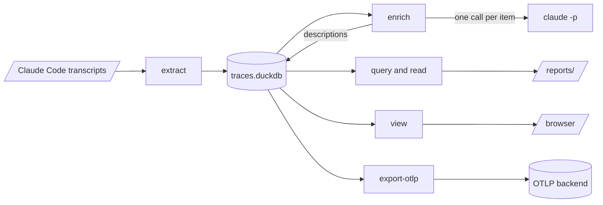

# hyphae 🍄

hyphae turns AI coding-agent sessions into queryable telemetry and evidence-backed findings. Use it to see where agents spend time, tokens, and money, which guidance they ignore, and which tools trip them up.

The goal is to enable continuous improvement of repository setup and/or coding agent configuration to improve coding agent performance.

The first extractor supports **Claude Code**.

## Status

The project is early, but the Claude Code pipeline runs end to end. It extracts transcripts into a local DuckDB trace store and adds model-written descriptions of each run, turn, and session. A local viewer serves the store in a browser, and an exporter sends it to any OTLP backend. Reports from completed analysis runs live under `reports/`; [the report guide](reports/README.md) explains how to read them and write the next one.

hyphae does not yet import Claude Code's native OpenTelemetry spans. All current metrics come from transcripts.

## How data moves



Read the guide for each stage: [the store](docs/store.md), [enrichment](docs/enrichment.md), [analysis](docs/analysis.md), [the viewer](docs/viewer.md), and [OTLP export](docs/otlp-export.md). Working on the viewer's own pages has [a guide of its own](docs/ui-development.md).

## Set up the project

```bash
mise run setup    # install the environment from uv.lock and the pre-commit hook
mise run check    # format, lint, type-check, lint the docs, and test
```

Every project task lives in `mise.toml`. Use `mise run check-fast` while you work.

## Find Claude Code sessions

Claude Code writes one JSON Lines transcript for each session:

```
~/.claude/projects/<encoded-cwd>/<session-id>.jsonl
~/.claude/projects/<encoded-cwd>/<session-id>/subagents/agent-<id>.jsonl
```

`<encoded-cwd>` is the session's working directory with each `/` replaced by `-`, so `~/repos/mycelia` becomes `-Users-nob-repos-mycelia`. Claude Code records subagent work in separate files; ignoring them undercounts the session. It also records worktree sessions under each worktree's path, and every command that takes a project path includes those sessions.

List the sessions hyphae finds for a project:

```bash
uv run hp sessions ~/repos/mycelia
```

[The schema guide](docs/schema.md) records each field's meaning and the session that established it. Check it instead of relying on memory because Claude Code can change transcript shapes without notice.

## Extract and query a project

Extract transcripts into `data/traces.duckdb`:

```bash
uv run hp extract ~/repos/mycelia
```

Pass `--db` to write elsewhere. Later runs replace all rows for each changed session and skip unchanged sessions.

Run a saved query:

```bash
uv run hp query session_counts --project ~/repos/mycelia
```

`hp query --list` names every query in the library with its scope and the parameters it needs bound; the SQL lives in `src/hyphae/analyze/queries/`. The command prints the citation line that every finding must carry; [the analysis guide](docs/analysis.md) explains the contract. For questions the saved queries do not answer, query DuckDB directly through the `session_rollups` and `corpus_rollups` views, which omit records copied by a fork or resume. The store can outlive its source transcripts, so read [the store guide](docs/store.md) before deleting it.

## Describe what happened

Preview what an enrichment pass would send and what it would cost:

```bash
uv run hp enrich --project ~/repos/mycelia --dry-run    # what it would send, and what that costs
```

Enrichment describes every agent run, main turn, and session, then stores each answer beside its source rows. It skips unchanged items. Read [the enrichment guide](docs/enrichment.md) before enriching a real corpus.

## Treat transcripts as private

A transcript contains everything the agent read, including file contents and credentials. Raw extracts belong in `data/`, and telemetry keys belong in `.env`; both paths are gitignored. Never commit either. Test fixtures must be redacted excerpts trimmed to the records each test needs.

## AI Guidance Locations

Read `CLAUDE.md` first. Project guides live in `docs/`; agent rules and subagents live in `.claude/`.
