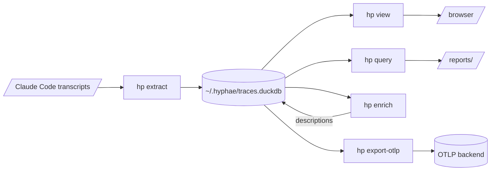

# hyphae 🍄

hyphae turns AI coding-agent sessions into queryable telemetry and evidence-backed findings: where an agent spent time, tokens and money, which guidance it ignored, and which tools tripped it up. Use those findings to improve a repository's setup and the agent's configuration. Claude Code is the first agent it reads.



Each stage has a guide: [the store](docs/store.md), [the viewer](docs/viewer.md), [analysis](docs/analysis.md), [enrichment](docs/enrichment.md), and [OTLP export](docs/otlp-export.md). Completed passes live under `reports/`; [the report guide](reports/README.md) covers how to read one and write the next.

## Quickstart

### Install `hp`

hyphae needs [uv](https://docs.astral.sh/uv/) and Python 3.13 or newer. uv fetches Python if you don't have it:

```bash
uv tool install git+https://github.com/nathanielobrown/hyphae
hp --help
```

### Find a project's sessions

Claude Code writes each session as JSON Lines under `~/.claude/projects/`, one file for the main transcript and one per subagent. `hp sessions` lists what hyphae finds for a project, subagents included:

```bash
hp sessions ~/repos/mycelia
```

[The session layout guide](docs/session-layout.md) covers where those files sit and how they join up. [The schema guide](docs/schema.md) explains what each field means and which recording proved it. Check them instead of memory: Claude Code changes its transcript shapes without notice.

### Extract them

```bash
hp extract                    # pick from every project Claude Code has recorded
hp extract ~/repos/mycelia    # or name one or more
```

This writes [the trace store](docs/store.md), one DuckDB file at `~/.hyphae/traces.duckdb` shared by every checkout. Run it again after more sessions; it replaces the rows for each changed session and skips the rest.

The bare command opens a picker over every recorded project, worktrees folded in and last time's choice pre-checked. Confirming writes the choice to `settings.json` beside the store, and `hp extract --last-picked` reruns it without the prompt; `hp extract --all-projects` takes every recorded project, scratch checkouts included. Only the picker writes that memory, so a typed path or `--all-projects` never retargets the `--last-picked` a cron job runs.

### Read the store

```bash
hp view                                             # every session, turn, run and call as a page
hp query --list                                     # the saved queries and the parameters each needs
hp query session_counts --project ~/repos/mycelia   # one of them, with its citation line
```

`hp view` opens the store in your browser ([the viewer guide](docs/viewer.md)). `hp query` runs a query from the library in `src/hyphae/store/queries/` and prints the citation every finding must carry. Follow [the analysis guide](docs/analysis.md) to turn queries into a report.

### Describe and export

`hp enrich` has a model write a description, category and outcome for every run, turn and session. It runs the `claude` CLI, so log in there first. Start with `--dry-run` to see what a pass would send and cost ([the enrichment guide](docs/enrichment.md)).

`hp export-otlp` ships the store to an OTLP backend as spans. The key comes from the named backend's environment variable ([the OTLP export guide](docs/otlp-export.md)).

## Work on hyphae

```bash
git clone git@github.com:nathanielobrown/hyphae.git
cd hyphae
mise run setup    # the environment from uv.lock, and the git hooks
mise run check    # format, lint, type-check, lint the docs, and test
```

Every task lives in `mise.toml`; run `mise run check-fast` while you work. Inside a checkout, `uv run hp` runs the checkout's code rather than the installed tool, and `uv tool install -e .` makes the global `hp` track the checkout.

Worktrees set themselves up. `tools/setup-worktree` trusts the checkout, copies the gitignored files `.worktreeinclude` lists from the primary checkout, and syncs the environment. `git worktree add` uses the `post-checkout` hook; `claude --worktree` skips git hooks, so a Claude Code `SessionStart` hook runs it instead.

## Treat transcripts as private

A transcript contains everything the agent read, including source and credentials. Keep raw extracts in gitignored `data/`, and backend keys in the environment, never in a file. Test fixtures are redacted excerpts trimmed to the records a test needs.

## Where the AI guidance lives

Read `AGENTS.md` first. Project guides live in `docs/`; agent rules, skills and subagents live in `.claude/`.
