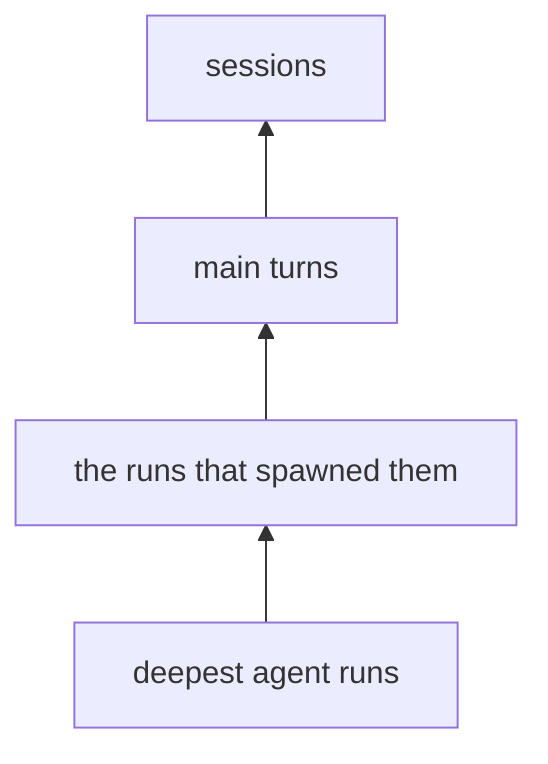
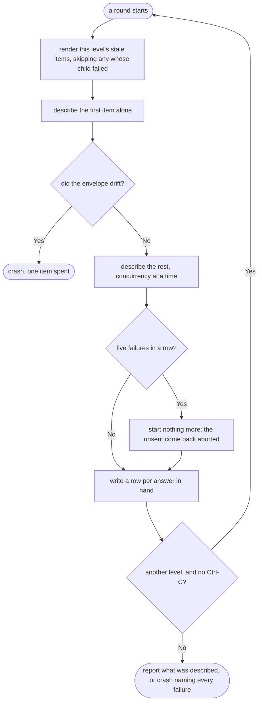

# Enrichment

Enrichment describes every agent run, main turn, and session in the trace store. Findings can then filter and group by meaning — for example, every debugging turn that failed — without reading each transcript again.

Start with a dry run:

```bash
uv run hp enrich --project ~/repos/mycelia --dry-run   # what it would send, and what that costs
uv run hp enrich --project ~/repos/mycelia             # describe everything stale
```

Enrichment spends the Claude Code subscription by running `claude -p` once per item. It needs no API key and creates no separate bill. Log in with `claude` first. Before a paid run renders anything, enrichment runs `claude auth status`; it refuses to continue if `claude` is absent, logged out, or logged in without a subscription. A dry run skips this check because quoting costs nothing and the person pricing a pass may not own the active login.

`src/hyphae/cli.py` defines every flag. Use `--limit` for a cheap development pass. `--concurrency` controls how many `claude` processes run at once within a round; it defaults to four.

## Each item gets one enrichment row

`turn_enrichments`, `agent_run_enrichments`, and `session_enrichments` hold one row per described item. Each row has four model-written fields: `description`, `category`, `outcome`, and a nullable `friction` note. `src/hyphae/enrich/taxonomy.py` defines the closed vocabularies. The enricher rejects answers outside them.

Query these rows through `enriched_turns`, `enriched_agent_runs`, and `enriched_sessions`. Each view left-joins enrichments onto the live base rows, so a `NULL` description means "not described yet." Count those rows when reporting coverage. To keep `description` consistent across the views, `enriched_agent_runs` calls the run's own recorded model `agent_model`; the run's recorded task is `brief` and needs no rename.

The query library provides three report-ready questions, which `hp query` can run:

- `enrichment_coverage` reports coverage at each level by category, outcome, model, and prompt version; the row with no category is the gap
- `enrichment_digest` returns one session's descriptions under keys that align with `session_timeline`, `run_timeline`, and `view_runs`
- `select_enrichments` draws a seeded number of described items from each category for checks against their source records

These queries read tables created by an enrichment pass. If no pass has touched the store, they fail and explain that the tables are missing.

[The viewer](viewer.md) shows each enrichment beside its source. It reads the three tables directly, rather than the views, so it can distinguish described items from undescribed ones. It checks for the tables first, which lets every page work before the first enrichment pass.

## Descriptions move up without transcript text

A prompt includes its children's descriptions, never their transcript text. A session prompt has one line for each thing the session did, but no transcript. This keeps enrichment affordable when tool results alone span hundreds of megabytes. It also requires a bottom-up pass:



The enricher describes agent runs in rounds, deepest first, so it never describes a parent with a missing child. When `parent_agent_id` names an agent, that agent is the parent. Otherwise, the parent is the transcript containing the tool call that spawned the run.

A session's direct children are its main turns and any runs that nothing else embeds. The latter include teammates started by the team mechanism and runs spawned by calls that belong to no turn. The same parent rule both orders rounds and finds these children, so a separate rule cannot silently drop them.

The `describable_sessions` view excludes sessions that give the model nothing sound to describe:

- Sessions with no main turn and no agent run. Recorded examples are compaction records and sessions with duplicate UUIDs
- Sessions whose turns made no API call, such as `/model` or `/effort` turns handled by the CLI. A quality-control pass found that the enrichment model invented work when asked to describe them

A main turn that ran a slash command includes the command's printed output, capped at 2,000 characters. For a turn that made no API call, this may be the only record of what happened. In the mycelia corpus on 2026-08-13, 272 of 280 such turns had output.

The prompt names all three output states: recorded output, "the command printed nothing," and "not recorded." Every recorded `/clear` falls into the second state. Claude Code stores slash-command output in either of two record shapes, as [reading transcript records](transcript-reading.md#attach-slash-command-output-to-the-command-turn) records. If the enricher finds a third shape, it stops rather than treating the answer as empty.

`sweep_zombies` checks session rows against `describable_sessions`. The next pass removes enrichments written before this gate and reports how many it removed. The gate does not apply to turns, so a turn that made no API call keeps its row.

## Four values decide whether a row is stale

A row is current only when these values match:

- The rendered prompt's content hash
- The level's prompt version
- The taxonomy version
- The model that answered

The hash covers rendered content, not extraction metadata. Re-extracting unchanged text therefore costs nothing. A changed child description changes its parent's rendered prompt, which makes the parent stale in the same invocation. If the new child description matches the old one, the cascade stops there.

For this reason, a dry run reports an upper bound. It quotes every stale item and every item that embeds one; it cannot know which descriptions will change before the model answers.

A dry run makes the rounds a paid pass makes, against a model that answers everything and fails nothing, so `--dry-run --limit N` names the items `--limit N` sends, in the order it sends them.

There is no resume file. A failed item writes no row and remains stale for the next pass. An item with a failed child also writes nothing. Otherwise, a description built around a missing child could be hashed as current and no later pass could repair it.

## Each round protects paid answers



The enricher plans one round at a time so each parent can include descriptions written in the preceding round.

Within a round, a thread pool runs one `claude -p` process per item, up to `--concurrency` at once. Each process receives the level instructions through `--system-prompt`, rendered content on stdin, and the answer contract through `--json-schema`. It runs in a temporary directory with tools, settings, MCP, and slash commands disabled. Rendered content is untrusted transcript text; it cannot invoke a tool or leave a session in an extractable project.

The subprocess gets a constructed environment rather than inheriting the caller's. It contains only `HOME`, `PATH`, `USER`, and `MAX_THINKING_TOKENS=0`. `USER` lets the process find the OAuth token in the keychain; without it, every call appears logged out. Because `ANTHROPIC_API_KEY` and `ANTHROPIC_BASE_URL` never reach the child, they cannot divert work from the subscription. Preflight checks auth under the same environment used by paid calls.

The first item runs alone as a canary and is the only call that may crash the pass immediately. Every later call spends the subscription. `submit` returns all results before the enricher writes the round, because an exception during fan-out would otherwise discard answers already paid for.

Five consecutive failures trip the breaker. The enricher starts nothing else, marks the unsent items `Failed(aborted)`, writes completed answers, and then crashes with both kinds of failure in its report. Each unsent item carries what ended the round, so a pass that failed on every item names its cause rather than listing keys.

**Ctrl-C stops after the current round, not during it.** The enricher waits for running calls, writes their answers, and stops before the next round. Press Ctrl-C again to abandon calls still in flight; they return `aborted`, like any item with no answer. This behavior makes it safe to stop a pass that runs for hours, while `--limit` remains the pacing control.

A pass holds the store from its first round to its last, and DuckDB admits one process at a time, so `hp view` answers 503 and `hp extract` gives up while one runs ([the store guide](store.md)).

### The CLI envelope is pinned to `claude` 2.1.221

With `--output-format json`, this version returns one object. The enricher reads four fields and ignores all others, so an added field does not count as drift:

- `is_error` and a nonzero exit status mean the call failed. The enricher retries once, then records `api_error` with the tail of what the CLI wrote on stderr. Never stdout: the answer comes back there, and with it whatever transcript text the render carried
- `stop_reason` equal to `max_tokens` means the answer was cut off, so the result is `invalid_output`. For other values, `structured_output` decides validity
- `modelUsage` is keyed by model ID. A key other than the requested model means the CLI substituted one, so the row's model would no longer be a truthful staleness key
- `structured_output` holds the answer. Its absence is `invalid_output`, not drift, because the CLI omits it when the model returns nothing conforming; the recorded logged-out envelope demonstrates this case

A missing contract field is drift. On the canary, it raises `EnvelopeDrift` after spending one item rather than describing the corpus against an unread shape. After the canary, it counts as a per-item failure. Claude Code owns this envelope and may change it without notice. When it changes, re-record `tests/enrich/fixtures/` and record the Claude Code version.

## A dry run quotes money, not elapsed time

The quote reads the same price table every other reader does, `src/hyphae/extract/pricing.py`; `src/hyphae/enrich/cost.py` owns the arithmetic over it. It estimates tokens from rendered characters, then adds each level's instructions and a flat transport cost per item. Each fresh subprocess pays that cost for the CLI framing and `--json-schema` payload.

The quote uses list price. The API batch discount no longer applies, and prompt caching is priced at zero, so the estimate runs high. A full Haiku pass over the mycelia corpus costs single-digit dollars.

The practical cost is time. At about four seconds per item, measured on 2026-08-13, a full pass with four workers takes more than an hour. Those workers share the Claude allowance with this project's agents. `--limit` is the only pacing control, and you must set it yourself.

Prices and models change. `--model` accepts only the names the price table prices, so asking for an unpriced one is refused at the door — before preflight, before the store is read, and before a prompt is rendered. A typo costs the message and nothing else.

## Prompt and taxonomy changes buy new descriptions

Both changes deliberately make stored rows stale:

- After changing a level's instructions, bump that level's `prompt_version` in `src/hyphae/enrich/levels.py`. The content hash cannot see the instructions
- After adding, renaming, or redefining a taxonomy member, bump `TAXONOMY_VERSION`. The model classifies from these definitions, so the change re-describes every level

A run-level prompt bump cascades through later rounds. Price it with `--dry-run` before starting the pass.

## The design records the tradeoffs

[The enrichment design](../plans/enrichment/design.md) records the alternatives, measurements, and as-built differences behind these choices.
