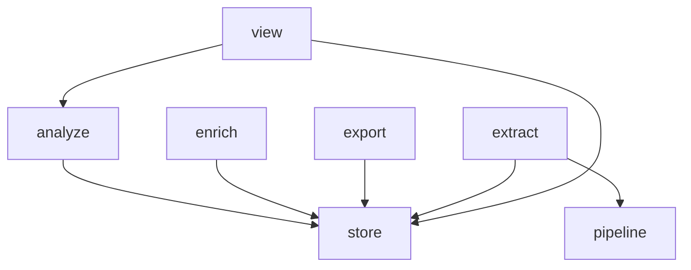

# Layering

Which package under `src/hyphae` may import which, held by a gate and drawn from the imports themselves.

## The layers contract

`[tool.importlinter]` in `pyproject.toml` lists the children of `hyphae` as layers, top to bottom. A module may import anything on a line below its own and nothing above; modules sharing a line with `|` are independent of each other. The contract is exhaustive: every child of `hyphae` must sit on a line, so a new package picks its layer there rather than adding a rule beside the list. Later phases of the store-layering plan edit the list; nothing else does.

`mise run lint-imports` runs the contract, in `check-fast` and in `check`. A red run names the importer and the imported package, then each import behind the break as `module -> module (l.N)`. The fix is to move the code, not the line: an import that points up is the code in the wrong package, or the contract describing a layering the code has outgrown, and either way the answer is a design change rather than a suppression.

## The graph

Every direct import between the drawn children of `hyphae`, from the importer to what it imports, generated by `mise run cogs` from the same graph the contract reads. `cli` is left off because it imports everything, and so are the leaves on the contract's two bottom lines — packages and modules any package may import. `cogs-check` in `check` fails when this diagram lags the code.

<!-- aigarden:cog sh "uv run python -m tools.gen_imports" -->

<!-- aigarden:end -->
