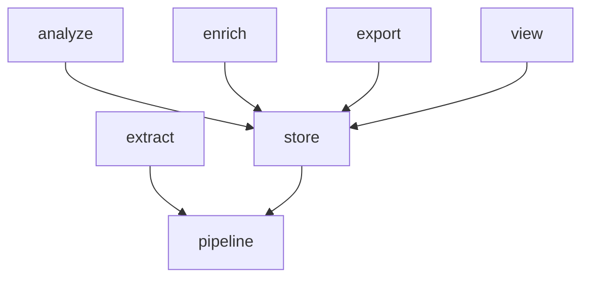

# Layering

Which package under `src/hyphae` may import which, held by a gate and drawn from the imports themselves.

## The layers contract

`[tool.importlinter]` in `pyproject.toml` lists the children of `hyphae` as layers, top to bottom. A module may import anything on a line below its own and nothing above; modules sharing a line with `|` are independent of each other. The contract is exhaustive: every child of `hyphae` must sit on a line, so a new package picks its layer there rather than adding a rule beside the list.

`mise run lint-imports` runs all three contracts, in `check-fast` and in `check`, and the pre-commit hook runs them when Python is staged (`tools/pre-commit`). A red run names the importer and the imported package, then each import behind the break as `module -> module (l.N)`. The fix is to move the code, not the line: an import that points up is the code in the wrong package, or the contract describing a layering the code has outgrown, and either way the answer is a design change rather than a suppression.

## The forbidden contracts

A second contract in the same table says which package may name `duckdb`: only `store`. It lists every other layer as a source and `duckdb` as forbidden, with `allow_indirect_imports` on: the contract is about who imports the driver, not who reaches it, since whatever a source needs from the database it gets from `store` — a page or `hp query` through the `Store` handle `src/hyphae/store/handle.py` hands out, `hp enrich` through the enrichment repository the handle hands out, prepared on a writable one, and `hp export-otlp` through the OTLP ledger, the writer [the store guide](store.md) sets apart.

A third keeps everything above the store from parsing a transcript: the four packages sharing the line under `cli` may not import `extract`. The layers alone would permit it, since the parser sits below them; the contract holds that a page, a pass, a query or a send reads a session back through `store`, and only `cli` builds an extractor. A red run of either forbidden contract names the module and the line of the import.

## The graph

Every direct import between the drawn children of `hyphae`, from the importer to what it imports, generated by `mise run cogs` from the same graph the contract reads. `cli` is left off because it imports everything, and so are the leaves on the contract's two bottom lines — packages and modules any package may import. `cogs-check` in `check` fails when this diagram lags the code.

<!-- aigarden:cog sh "uv run python -m tools.gen_imports" -->

<!-- aigarden:end -->
