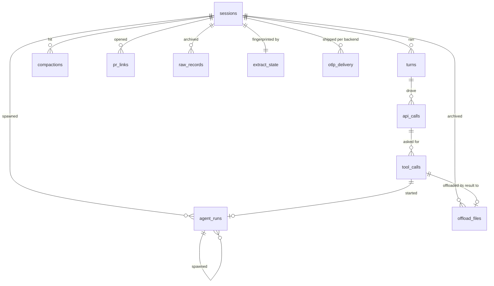

# The trace store

The trace store is one DuckDB file, `data/traces.duckdb`: the archive `hp extract` writes to and every query reads. It is gitignored with the rest of `data/`. Treat it as an archive — read this guide before deleting it, moving it, or changing a version constant.

## The store holds traces and derived data



`_SCHEMA` in `src/hyphae/export/duckdb.py` defines the trace tables and their columns. The OTLP exporter defines its own `otlp_delivery` table in `src/hyphae/export/otlp_delivery.py`. Other components that write to the store also own their tables, including the enrichment tables described below. [The schema guide](schema.md) defines each telemetry field and cites the recording that proves it.

A session's main thread and agent runs use the same trace tables. The `source` column distinguishes them, so `(session_id, source, id)` identifies a turn or call.

The store's clock is UTC. Every timestamp is a `TIMESTAMPTZ`, and each writer and reader opens its connection with `SET TimeZone='UTC'`, so a day boundary means the same thing wherever the reader sits. A window measured back from a date is therefore a UTC day, which is what `hp query` defaults `--as-of` to.

Queries use views instead of reading the trace tables directly. `refresh_views` in `src/hyphae/export/duckdb.py` defines `live_*` views, which omit records replayed by a fork. Which tables get one comes from the model rather than a list kept here: the fields of `LiveRows` in `src/hyphae/model.py` are the family, and a table whose model declares `replayed` gets the predicate. `SessionTrace.live()` returns the same rows for a session still in hand, so the store's answer and the model's are one answer. The `corpus_*` views also omit records already stored for an earlier session. Resumed sessions copy their ancestor's records, so counting both would count the same records twice. `session_rollups` and `corpus_rollups` reduce each family to one row per session.

`open_trace_store` in `src/hyphae/export/duckdb.py` is the one way into a store that already exists: the viewer, `hp query`, `hp enrich` and `hp export-otlp` all open through it, and each translates its refusals into the currency it reports in. Every open rebuilds those views, so editing a definition reaches `hp view`, `hp query` and `hp enrich` at once rather than at the next extract. A read-only connection cannot replace a stored view, so it builds the same statements as temporary views; those shadow the stored ones for the life of the connection, including inside a stored view that names one. A reader pays about 3 ms for that on a 15 GB store.

[Enrichment](enrichment.md) adds three `*_enrichments` tables keyed one-to-one to sessions, turns, and agent runs. It also adds views that join the enrichments to those records. Until an enrichment pass writes these tables, queries against them fail with an error that says they don't exist.

## One process writes at a time, and the others queue

DuckDB admits one writer and offers no lock timeout of its own, so every open through `open_trace_store` waits for a budget of its own and then gives up, reporting the store, the budget it spent, and DuckDB's own line naming the process that holds the file. A page waits one second: a reader is owed an answer or a 503, not a hung tab. A command waits ten (`PAGE_WAIT` and `CLI_WAIT` in `src/hyphae/export/duckdb.py`).

`hp extract` holds the file only while it writes. It prepares the store and lets go, reads its fingerprints read-only, and takes the write lock for one transaction per session — so the parse between sessions costs no lock at all, and [the viewer](viewer.md) answers pages throughout a long extract. Those per-session writes skip the view rebuild the opener does, which costs about 60 ms against 5 ms for the write itself on a store grown from the fixture corpus to 9.5 GB (measured 2026-08-30); the store the extract prepared already holds them.

`hp enrich` and `hp export-otlp` are the other way round: each holds one connection for its whole run. They queue for the store like anything else, and while one runs nothing else reaches the file at all — DuckDB's lock shuts out readers as well as writers, so [the viewer](viewer.md) answers 503 until the pass ends. Price a long pass accordingly.

## The store is the only durable archive

Claude Code deletes session transcripts and their `tool-results/` files from disk after a few weeks. This constraint shaped [the trace-pipeline design](../plans/trace-pipeline/design.md). The extractor archives every line: `raw_records` holds transcripts, while `offload_files` holds tool outputs that Claude Code moved out of them. A refresh keeps rows for sessions whose source files are gone instead of making the store mirror the disk.

Nothing is redacted on the way in, and nothing is redacted for now. Every prompt, model output, tool result, and file an agent read stays intact in the store and reachable in [the viewer](viewer.md). Fixtures committed to this repository are the opposite case: they stay redacted excerpts (`.claude/rules/testing.md`).

Once Claude Code deletes those files, the store holds the only copy. Deleting it can destroy sessions that extraction can't recover. The archived `raw_records` contain enough data to reparse a pruned session, but that feature isn't built; the design lists it as out of scope.

## Choose the right path for each version change

Each session fingerprint includes `EXTRACTOR_VERSION` from `src/hyphae/extract/claude_code.py`. Raising that version makes the next refresh re-extract every session whose files remain on disk. Extraction updates the existing store, so you don't need to delete it. Pruned sessions keep the rows produced by the parser that first extracted them.

`SCHEMA_VERSION` in `src/hyphae/export/schema.py` stamps the file, not one owner's tables: three modules create tables in the one DuckDB file, so the version belongs to the file they share. Opening a store for write carries it forward. `MIGRATIONS` holds one step per version, keyed by the version it produces, and a store older than the build runs every step above it in one transaction. A store newer than the build, or one no step reaches, is still refused and sent to a fresh store — don't delete the old one until you run the check below. A read-only open cannot migrate, so the viewer and the analysis runner refuse an older store and tell you to open it for write once.

Migrating rather than refusing bends this project's preference for clean breaking changes over compatibility shims. It loses to the constraint above: the store can hold the only copy of a pruned session, so a schema change has to move the store it finds rather than ask for a fresh one.

The version alone doesn't catch a DDL edit that reached a store already on disk, because `CREATE TABLE IF NOT EXISTS` leaves a table that exists alone. So each owner also calls `check_shape` with its own DDL immediately before running it. It derives what that DDL would create by running it against a scratch database, diffs the result against the file, and names any table whose columns disagree. A declared table the store lacks is not drift — the enrichment and delivery tables exist only once those layers have run — and views are excluded, since `CREATE OR REPLACE` rebuilds them at every open.

You meet this machinery when you change a DDL and `tests/export/test_schema.py` fails: it digests each owner's table statements and holds them to the current version. Bump `SCHEMA_VERSION`, add the step that carries an existing store across your change to `MIGRATIONS` under the new version, then set the digest to the one the failure prints.

A fresh store holds no `otlp_delivery` table at all; the first send to a backend creates it. Because `export-otlp` uses that table to track what each backend confirmed, the next export sends every session to every backend again. See [the OTLP export guide](otlp-export.md).

## Compare session IDs before deleting an old store

You can delete an old store after the canonical store contains every session ID found in it:

```sql
ATTACH 'data/traces.duckdb' AS canonical (READ_ONLY);
ATTACH 'old.duckdb'        AS old       (READ_ONLY);
SELECT id FROM old.sessions EXCEPT SELECT id FROM canonical.sessions;
```

No rows means the canonical store contains every session from the old store. A returned ID marks a session that the canonical store has never seen. Its source files may have been pruned, leaving the old store as its only copy.

This query compares session IDs, not table rows. It answers one question: would deleting the old store lose an entire session after re-extracting the same source files?
