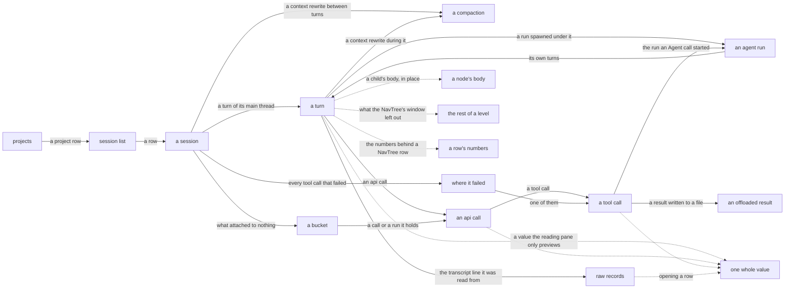

# The trace viewer

`hp view` opens the trace store in a local browser. Everything a session recorded is a node with a page of its own — the session, its turns, the runs it spawned, the api calls, the tool calls, the compactions between them — and you read one node at a time, with a NavTree beside it showing where that node sits. Copy the URL of anything you want to cite.

The server binds only to `127.0.0.1`, opens the store read-only, and serves only vendored assets. Run `hp view --help` for flags. [The node-browser design](../plans/viewer-node-browser/design.md) holds the choices behind the NavTree, [the viewer-polish design](../plans/viewer-polish/design.md) the ones behind what a row measures and the columns it sits in, and [the trace-viewer design](../plans/trace-viewer/design.md) the ones behind the pages around them. [URLs and page bounds](viewer-bounds.md) covers what a URL may ask for and what a page is allowed to weigh, and [node titles and marks](viewer-titles.md) what every surface calls a node. A page is Python: each page is a package under `src/hyphae/view/pages/` building its markup with htpy, under the rules in `.claude/rules/viewer-ui.md`, and [the UI development loop](ui-development.md) is how to edit one and watch the page: `--dev` reloads the open page on save, and `mise run gallery` serves the scenarios the tests pin.

## Follow a session down to any record it holds

Solid edges lead to pages with their own URLs. Dotted edges fetch a fragment into the open page.

<!-- aigarden:cog sh "uv run python -m tools.gen_routes" -->
| Page | Route | Description |
| --- | --- | --- |
| Projects page | `/` | Every project the store holds sessions for, most recently active first |
| Session list | `/sessions` | One page of sessions, under the filter, sort and size the URL carries |
| A session | `/session/{session_id}` | A session's own node: what it was, and its main thread as the NavTree's first level |
| A node on a thread | `/session/{session_id}/thread/{source}/{kind}/{node_id}` | One node recorded on a thread: a turn, an api call, a tool call, or a compaction |
| An agent run | `/session/{session_id}/run/{run_id}` | One agent run: the brief it was given, and its own thread of turns |
| Unattributed calls | `/session/{session_id}/thread/{source}/unattributed` | One thread's api calls that answer no turn — a resume's calls answer turns that live in the session it resumed, and this is where they are read |
| Unattached runs | `/session/{session_id}/unattached` | The session's agent runs no spawning call resolved |
| Errors page | `/session/{session_id}/errors` | Every failed tool call of one session, in the order they happened |
| Query page | `/query/{query_name}` | One library query's SQL, under the bindings a page cited it with |
| Records page | `/session/{session_id}/thread/{source}/records` | One page of a thread's raw transcript — where a report's citation lands |
| An offload file | `/session/{session_id}/offload/{offload_name:path}` | One chunk of a tool result Claude Code wrote to a file beside the transcript |
<!-- aigarden:end -->

`build_app` in `src/hyphae/view/app.py` extends the routes of one package per page onto the app, fragments included, and the table above is read back off the app it builds. Nothing renders in the reading pane that a cold GET of its own URL doesn't render whole, NavTree and all.

## The landing page counts projects

`/` lists the projects the store holds sessions for, most recently active first, with sessions and spend over the last 7 days, the last 30, and all time. The page is [bounded](viewer-bounds.md#hard-bounds-cap-every-page-most-at-500-kb) like every other, so a store holding more projects than it shows ends with the number it left out. A row opens the session list filtered to that project. Sessions recorded from a checkout's worktrees count under the checkout, and sessions with no recorded directory gather into an unlinked `(no project)` row. The footer cites the query and `as_of`, the date both windows were measured back from, so the page reproduces tomorrow.

## The session list keeps the query visible

The list has one row per session. A row shows how long ago the session started over its timestamp, its title and project, rollup counts, its tool errors as a rate over the count, cost over output tokens, wall time over active time, the agent types it spawned with a count of each, and its skills. A column showing two values is one cell read as two lines: the value the column is scanned for, and the texture under it. Over a store an enrichment pass has run against, a Work column says what kinds of turn the pass found. Every column heading sorts by that column; click it again to reverse the order. Sessions the store has no value for sort last either way — a session it knows nothing about is neither the newest nor the oldest. Errors sorts by the count rather than the rate: one failure in one call is 100% and not the session someone ranking by errors is looking for. A `*` after the cost means the session called a model missing from the price table, so the shown total is a floor. A project directory under the home of whoever is reading prints with `~` in its place, on this page, on the landing page, and in the crumb every node page leads with; the link, the filter and the suggestion box still carry the path the store holds, because that is what a filter matches.

Rows show only the head of long text: 100 characters for the title and project path, four skill names and four agent types followed by the number omitted, and three kinds of work. Each of those heads ends in an ellipsis where the value went on — the kinds of work are the exception, because that vocabulary is closed and no member of it reaches the width it is cut at. The session header shows five skill names of up to 60 characters along with its other fields; it too stays bounded. A name or PR URL longer than that ends in an ellipsis, and a PR URL the page had to cut is printed rather than linked: half a URL points somewhere else.

The form above the list filters by project, date range, skill, or a minimum number of failed tool calls. The project filter matches a path prefix, the same rule as the CLI's `--project`: filtering by a checkout keeps the sessions its worktrees recorded.

Filters survive sorting and paging. The `clear` link beside the form drops them. The footer prints a citation after paging and names every active filter, so it describes the rows on screen.

## The NavTree opens one path and nothing else

Beside every node page is the session's NavTree, with one path open: the selection, its ancestors, each ancestor's children, and the selection's own children. Clicking a row selects it, which opens that row's path and closes the one you left. There are no independent twisties and no way to open two branches at once, so no session makes the NavTree wider than one open path. Its depth is a hard limit rather than a cap: an open path runs at most 16 levels, and a node deeper than that fails instead of serving a page the byte arithmetic never priced. The deepest chain the recorded corpus holds is 14 — a tool call inside a run five spawns down — so the margin is one more spawn level.

The page itself does not scroll. Under the masthead the NavTree and the reading pane each carry their own scrollbar, so reading down a long tool result leaves the tree where it stood. The tree opens centred on the row you are reading, and every step of the open path above it clamps at the top of the tree while the rows under it go by, so a reader deep inside a run can still see what they are inside. Narrower than 900 pixels the two stack and the page scrolls instead.

A session's children are the main thread's turns, the compactions that happened between two of them, its calls that answer no turn, and the runs nothing placed. A turn's children are its api calls and the compactions that happened while it ran, in the order they happened; an api call's are its tool calls. An agent run reads like a session: its children are its own turns. A run renders under the tool call that asked for it, one level deeper, and that tool call keeps its own slot with a link to the run at the head of its page. Where a row between the two is shut, the run stands under the deepest one that is not: a closed api call carries it directly, and a turn read with the api calls folded away carries it itself. So a run is always visible, and opening a row moves its indent rather than bringing it into being. The one place that stops is a level wider than the window below: a run under a child the cap cut goes behind the `+N more` with it, and that count says how many children were left rather than what hung off them, so the fetch is what stands the run again.

Above the rows are the presets: **full**, **no api calls**, **agents only**, with the one in force marked. Each is the node you are reading under a different NavTree, so a switch keeps your place and your knobs — the preset is [`?nav=`](viewer-bounds.md#urls-preserve-the-query-behind-what-you-saw), and the control is the only link on the page that changes it.

Every row with spend badges it: the dollar value sits on a warm ground that deepens with the row's share of what the session cost, logarithmic over three orders of magnitude, because a session's cheapest turn and its dearest are that far apart and a linear scale would paint all but the dearest alike.

A row with agent runs under it badges twice, `$own/$total`: what its own thread spent, then what its whole subtree did, each on its own ground. A turn that spawned four agents cost little itself and drove a lot, and one number can only say one of those. The session reads the other way round — `$main/$whole`, its main thread against what the store holds for the session — because there is nothing above it to gather what it spent. A run's cost is charged to every node it hangs under: the ⚒ row that asked for it, the api call that made that call, the turn that call answers, each run above it, and the session. So two ⚒ rows in one api call each claim the whole of what that call cost, and their totals sum past it: the call is the nearest thing the store prices to either of them, and a badge is a reading aid rather than an account. Tool calls show no cost and wear no badge, except a row that asked for a run, which is charged what the api call holding it cost. The `*` that marks an unpriced total is read narrower than the total it follows: it counts the api calls of the row's own thread, while the total gathers the whole subtree. So a row whose unpriced calls all ran inside a run under it shows a floor with nothing to say so.

Under every row that ends on a model's context window is the bar: it reaches as far across the row as the window was full when the node finished, in bands nested one inside the next. Nothing is drawn under them, so a bar is only what its row holds. What the node itself put there is left bright at the tip. A turn draws two grounds under that — the context the session opened on darkest, then the conversation that stood before the turn began — so the row runs dark to bright and a reader sees a window filling rather than one that was already two thirds full when the work started. The scale is linear against the window the model answers in — half a bar is half a window — because what the bar says is fullness against a limit. Twentieths are the steps, so a node that added less than one rounds to no band of its own.

A run's own share is its whole fill, because a subagent starts on an empty window, and it draws that fill in one muted gray, as a session does, so the threads sit quiet under the growth the column is there to read. A run whose own thread compacted is drawn full in that same gray whatever its last call held: it ran the window out, unasked and unseen. The red compaction badge on the same row is what flags it. A session reads fullness with no share of its own. A compaction reads the other way round — the ground is where the thread was left and the green band runs from there up to where it stood, because the space it gave back is the one measurement here that is good news; the window it is drawn against comes off the nearest call its thread made, since a compaction records no model of its own. The fill is read off the last call that answered: an interrupt reports no tokens ([the schema guide](schema.md)), and reading one as the end of the window would say the session ended empty. A model the window table holds no number for draws no bar rather than a bar against a guessed scale, and so a `[1m]` session — the suffix rides the request, not the answer — draws against the standard window and reaches the end of it early. Tool calls and buckets draw no bar; what a tool call took is its api call's.

A level opens on 200 children, and a `+N more` row says how many it left out. Clicking it fetches the rest of that level and stands the rows in its own place, so a wide branch opens where it is rather than sending you to another page. The row the open path descends through is always kept, inside the window. Nothing bounds what that click can bring back: a branch of ten thousand children answers with the ten thousand less the two hundred already on the page.

A tool call that came back an error carries an `error` mark on its row, in the same red the children log and the list use. A run whose own thread compacted says how often on its row, in that same red: a subagent compacts on a transcript you did not open, so nothing else in the tree shows it.

## Pointing at a row prints its numbers

Point at a NavTree row, or tab to it, and the numbers behind its badge and its bar appear beside the NavTree. A row fetches them once: 200 ms after the pointer arrives, or the moment focus lands anywhere inside it, so a keyboard reaches what a pointer reaches. There is nothing to pin. The popover belongs to the row, so it stays open while the pointer is inside it, and a click into it holds it open while you drag across a number and copy it.

A node made of api calls — a session, a turn, an agent run, a call — names the model that answered last and how full the window was when it ended, against the window that fullness was measured against. Under that stand three lines, each a token count beside what it cost: what the calls read from cache, what they took as new input, and what they wrote as output. The cache they wrote is charged on the new-input line, where its tokens are counted, so each column comes to the figure under it — what the node added over the node before it, signed, so a turn after a compaction reads as the negative it is, and the dollar the badge on the row draws. The dollars are that stored total taken apart at the price table the extract charged each call at, so the lines cannot disagree with the badge, and each wears the wash that badge wears: its share of what the session spent. How many api calls the node covers is printed when it is more than one. A window the table holds no number for reads `unknown` rather than scaling the counts to a guess, and where some calls ran on a model the table lacks, the popover says how many and the total is a floor.

Every one of those lines is the node's own thread, a session's main thread included. What the agent runs under the node spent stands apart, in two lines below the total: theirs, with their share of the whole beside it, and the two added up, which on a session's own row is the cost the session list prints for it. A node with no run under it draws neither, because a subagent charge of nothing and a total repeating the line above it are two ways of saying what the node already said.

A tool call has none of that, because its tokens are its api call's. Its popover shows how much it was asked and how much it gave back, the file its output was offloaded to when there is one, and the other tool calls the same api call asked for in the same breath — the parallel work a row alone cannot show. The one tool row that draws a cost — the ⚒ call an agent run hangs under — says where that cost came from rather than leaving it read as what the tool spent. A compaction is made of no api calls either. Its popover is where the window stood either side of the drop, the span it gave back, and the word Claude Code recorded for why. Only the two buckets have no popover: a bucket is a place rather than a node, with no row of the store under it to count.

## Jump straight to where a session failed

The NavTree opens one path, so a failure five spawns down a run tree is behind everything in front of it. `/session/{session_id}/errors` is the way past that: every `is_error` tool call the session made, on every thread, in the order they happened, each row a link to that call's own page. Every node page of a session that failed something carries the count and the way in, under the walk controls.

Standing on a failed tool call, the same block gains a step to the failure before it and the one after — across threads, because the list is the session's rather than one thread's. No other page runs the query: a reading pane on anything else has no step to offer.

The list is bounded like the landing page rather than paged: it shows the first 100 failures in that order and says how many it left. The stepper reads the same capped list, so a failure past the cap is one neither surface reaches. A session that failed nothing has no page here — the URL is a 404, worded apart from a session the store never held.

## The reading pane reads one node

The reading pane leads with the crumb chain: the way back out of the session first — 🏠 to the session list, then the project this session ran in, linking to that list narrowed to it — and after them every ancestor down to the node. A session the store recorded no directory for leads with 🏠 alone, and a project path too long to filter by prints unlinked rather than pointing at a filter nobody named. Under the chain stand the node's title and the facts the store holds for it, and under those:

- What an enrichment pass said about the node, when a pass has reached it
- The node's own fat values, cut to 4,000 characters, each with a link that fetches the rest: a turn's prompt, a run's task brief, an api call's text and thinking, a tool call's input and result, and the command a `Bash` call ran. A run shows two more, read off the call that spawned it: what it was asked, and what its parent received back. That answer is the spawning call's result rather than the run's last turn — a run that stopped without reporting told its parent nothing, and the page says so. A turn typed as a slash command has no prompt among its values: what was typed is the `<command-…>` wrapper Claude Code expanded it into, and the two facts inside it — the command and what followed it — stand as values of their own. The wrapper is still what was sent, and the thread's transcript has it whole
- The thread's transcript, and — for a turn — the archived line it was read from, in a `
` that fetches on open
- The children log: one numbered page of 100 children, as a table. A column per number the children are told apart by, each under a heading that names it — a turn's api calls read nothing like its tool calls, and a start time is not a duration. One wide column names the child and links to its page, and a `View` button opens the child's own body in place, as a row of the same table, without leaving the parent. An opened body stops one level down: an api call's lists the tools it called, as rows of the same table with no `View` of their own, and every other kind stands a count and a link to its own page. The heading counts the level, not the page; a level running past one page carries prev and next under it, and says which page of how many you are on
- Prev and next, two buttons that read the level the node is on: the row beside it, and at the end of the level whatever follows the branch. Neither descends — going down is what the NavTree is for — and a step that leaves the level shows `↑` instead of an arrow along it. Each names the neighbour's kind and its title. The buckets and the compactions are stops like any other, and the controls ignore what the NavTree was capped to: a reading order that shortened with the NavTree would skip nodes silently
- [Where the session failed](#jump-straight-to-where-a-session-failed): how many tool calls it failed, the way to the list of them, and — on a failed call — the step to the failure before it and the one after

A value is marked up in the syntax the record says it is written in: the JSON a tool was passed, the SQL behind a page, the shell a `Bash` call ran, and the file a `Read` returned — read off the name the call asked for, so a `.md`, `.py`, `.sql` or `.sh` result is shown as its source rather than rendered. A result the record names no file for is read as JSON, and printed as it was stored where it is not JSON. A tool result is evidence, and a heading made out of a `#` is a character the agent saw and the page does not. What a model or a person wrote is prose: the pane renders it as the Markdown it was written in, and so does the fetch that opens it whole, with a fenced block inside marked up in the language the fence names. The 4,000-character cut is made in the store and lands where it lands, so a preview can open a construct the whole value closes. Anything the viewer cannot place prints as it was stored, and so does a value past 256,000 characters, with a line saying why. Every page's footer cites the queries behind it, and each citation links to `/query/{query_name}`, which shows that query's SQL under the bindings the page used. Where a statement calls one of the library's shared SQL macros, that page prints their definitions above it, so what it shows runs in a `duckdb` shell that installed nothing.

`agent_runs.brief` shows as **task brief**: it is the one line Claude Code recorded to name the run, not a description of what the run did and not the instructions it was given — those are the **prompt** beside it. On this screen "description" always means enrichment.

## Enrichment appears beside the recorded trace

After [an enrichment pass](enrichment.md), the viewer places its output beside the stored telemetry. A `✨` marks a title a model helped write, and stands before the whole of it — on the NavTree row, the crumb, the log line, and the walk control. It is a claim about how the title was made rather than about which words came from where: a run's title is the agent type the session recorded followed by what the pass said the run did, and one glyph leads both halves. Three kinds of node can carry it, the three a pass describes: a session, a turn and an agent run. The pane carries the one glyph that explains itself: hover it for the model, when it ran, the prompt and taxonomy versions, and whether the row is stale. `stale` means the pass used an older prompt or taxonomy version, so rerun the pass; it does not mean the saved description is false.

The reading pane prints the first 200 characters of a description or friction line, marks where it cut, and stands a link behind the mark that fetches the rest into the block the head stood in — the preview-and-fetch every other fat value the reading pane shows rides. The session list adds each session's one-line description and two tags, cutting the line to the 100-character head a row's title takes and marking it there too. It does not show `stale` because the list joins the words written by a pass without loading the versions needed to judge them.

A store that has never been enriched has none of the enrichment tables. The viewer then shows no enrichment fields, and cites no enrichment query. An item the current pass has not reached looks the same.

## Extracts and page loads share the store

The viewer closes its database connection after each request, and `hp extract` holds the file only while it writes one session, so the two run together ([the store guide](store.md)). What each does when it lands on the other's lock:

- If a page loads while an extract is writing, it waits up to a second and then answers. Only a writer still holding the store after that turns into a 503 saying the store is being written; reload once the writer is done
- If an extract starts while a page request holds the store, it waits up to ten seconds. Past that it stops, naming the store and the process holding it
- `hp enrich` and `hp export-otlp` are the writers that do hold the store: each keeps it for its whole run, so every page is a 503 until the pass ends
- If a re-extract changes the schema while the viewer runs, the viewer returns 503 naming both versions and the one action that fits the store on disk — migrate it by opening it for write, or extract into a fresh one. Restart the viewer afterwards

The viewer fails at startup if the store is missing, its schema is unsupported, or the port is already in use.
