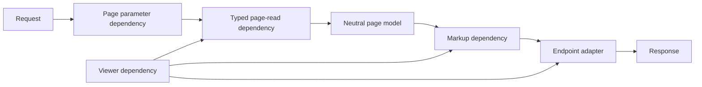

# Design: deepen each viewer page behind composed dependencies

Make every full-document route a small FastAPI adapter over a typed page-read dependency and a markup dependency, so Store queries, raw rows, citations, and page assembly stay behind one page-local seam.

The [decision record](deepen_viewer_reads_questions.md) settles the interface and test surface. This plan is for another agent to implement on the same branch. File references describe the current tree; verify them before each slice rather than treating this plan as a second source of truth.

## Outcome

A full-document request follows one dependency graph:



The endpoint knows only the Viewer and the rendered markup. The page-read dependency opens the Store, performs every query for that document, maps raw rows into a typed model, records the exact query bindings as citations, and closes the Store before the markup dependency runs. The markup dependency turns that model into `Html`. FastAPI caches a dependency used more than once in one graph, so a route may also ask for the typed model without paying for a second read.

This is the external seam of each page module:

- A parameter dependency owns the URL defaults, parsing, and 400 refusals
- A page-read dependency depends on the Viewer and the parameter dependency and returns a typed page model
- A markup dependency depends on the page-read dependency and the Viewer and returns `Html`
- The endpoint depends on the markup dependency and wraps it with `Viewer.html`

Do not return a `Response` from the markup dependency. That would erase the useful seam between rendered markup and the FastAPI adapter.

## Keep the Store window short

`src/hyphae/view/deps.py` explains why full documents do not use the yield-based `Db`: it holds the DuckDB connection until FastAPI finishes the response. Keep that rule.

A full-document page-read dependency should depend on `ViewerDep`, open the Store inside its implementation, build the complete typed model, and return only after the connection closes. The markup dependency then runs without a Store lock. Tiny fragment routes may keep `Db` when their current lock window is already deliberate and their markup is a line or two.

One request must not open the Store twice to satisfy the read and markup dependencies. The markup dependency consumes the cached typed result and performs no query.

## Put models at the new seam

Add a page-local `models.py` only when a typed value crosses from the page-read dependency to the markup dependency. This revisits the decision recorded in `plans/view-layout/design.md`: the new model has two module readers, so keeping it inside markup would make the read module depend on the implementation beyond its seam.

A neutral page model must not contain `Request`, `Response`, `HTTPException`, a DuckDB connection, `view.store.Row`, or untyped query bindings. It may contain typed citation values because evidence is part of the page-read result.

Move any row model created from a Store row and consumed by markup into `models.py`; it crosses the seam too. Keep markup-only values beside the markup function that creates and consumes them. Avoid a repository-wide base page model: the documents do not share one meaningful shape.

Update `tests/view/test_layout.py:test_a_models_module_appears_only_where_a_second_markup_module_reads_it`. Replace the old zero-model rule with the new contract: each `models.py` is imported by its page’s read module and markup module, is imported by no sibling page, and imports neither FastAPI, htpy, nor Store row types. Update the surrounding prose and `.claude/rules/viewer-ui.md` so this decision has one current home; do not rewrite the historical plan.

## Compose URL dependencies where meanings match

Use dependencies with dependencies rather than repeating query parameters on endpoints. Start from the existing `ViewerDep`, `Db`, and `KnobsDep` interfaces in `src/hyphae/view/deps.py` and `src/hyphae/view/pages/node/routes/knobs.py`.

Share a validator or dependency only when the URL values mean the same thing. Numbered children-log pages and numbered session-list pages may share a positive-page check. Bounded sizes may share the existing `checked` implementation, but each page keeps its documented default and ceiling from `src/hyphae/view/bounds.py`. Record cursors and offload character offsets remain page-specific because they are not page numbers. Do not create a universal pagination model with fields that most routes ignore.

The parameter model passed into a page reader should contain checked values. The reader must not repeat a bounds check or know how FastAPI represented an omitted query parameter.

Preserve every public URL, default, status code, and useful refusal message. FastAPI parameter dependencies may raise 400s directly. A page-read dependency may translate a missing typed result into the current 404. Do not add a framework-neutral refusal interface while HTTP remains the only adapter that needs one.

## Keep query evidence with the read

A page model carries the citations for the queries that produced it. Build each citation from the same binding mapping used for the query; do not reconstruct bindings in the markup dependency or endpoint.

Preserve the conditional evidence rules already documented in the source: for example, a page cites enrichment only when it queried enrichment, and an errors page does not cite a session-header existence probe when it did not run one. The implementation in `src/hyphae/view/pages/` is the source of truth for these cases.

A completed full-document endpoint must not import `hyphae.analyze.queries`, `ParamValue`, `view.store.Row`, `open_store`, or `page_rows`. Those belong to the page-read implementation. Use the deletion test during review: deleting the page-read module should force query vocabulary, raw columns, and citation construction back into the route.

## Scope

Apply the two-dependency chain to every full document mounted by `src/hyphae/view/app.py`, including the query page even though it reads the query library rather than the Store. Use the generated route table in `docs/viewer.md` to discover the current set instead of copying it from this plan.

The node page also serves expansions, details, enrichment lines, and popovers. Split reading from markup when either side contains real behavior or has more than one caller. A trivial fragment may use one dependency that returns markup; do not invent a one-field model only to satisfy a mechanical rule. Regardless of shape, move query names, binding maps, and raw row indexing out of the endpoint body.

Do not change SQL, URLs, rendered bytes, page bounds, the NavTree, or the meaning of a citation. Do not move viewer SQL out of the query library. Do not add a Store adapter or a general repository interface; this refactor deepens the existing page modules.

## Page package shape

For a normal page package, converge on this shape where the page earns each file:

```text
pages/<page>/
  models.py    typed values crossing the read → markup seam
  read.py      Store or query-library reads and raw-row mapping; no FastAPI or htpy
  markup.py    typed model in, Html out
  routes.py    parameter, read, and markup dependencies; endpoint adapter
```

A one-line FastAPI read dependency may adapt `ViewerDep` and a parameter dependency into the framework-free function in `read.py`; that line is an adapter, not a shallow module. Keep it next to the endpoint in `routes.py`.

The node page is large enough to keep its existing packages. Evolve it toward:

```text
pages/node/
  models.py             aggregate node-page values crossing into markup
  browser.py            one connection and the shared node-page read flow
  reads.py              row-to-node, facts, and children-log mapping
  routes/
    knobs.py            existing knob dependency plus numbered-page dependency
    pages.py            selection/read/markup dependencies and endpoint adapters
    expansions.py       fragment dependencies and endpoint adapters
    details.py          fragment dependencies and endpoint adapters
    enrichment.py       fragment dependencies and endpoint adapters
    popovers.py         fragment dependencies and endpoint adapters
  markup/               typed node-page models in, Html out
```

Move the implementation now in `src/hyphae/view/pages/node/routes/browse.py` into the framework-free node browser as the refactor permits. Its small external interface should take the selected node and checked knobs and return one aggregate node-page model. Keep kind-specific variation private. The eight URLs remain FastAPI adapters that construct the selection through dependencies. If removing `HTTPException` from the browser would force a broad new error hierarchy, leave the browser under `routes/` for this change and record why; depth matters more than a cosmetic move.

## Test only through URLs

The confirmed behavioral test seam is the URL served by `build_app`. Do not add direct tests for dependency functions, page models, or raw readers. Existing source-tree tests may change to hold the architecture, but they are not a second behavioral test surface.

Before the first move, run the relevant viewer tests and capture every fixture page’s response bytes with `tests/view/conftest.py:render_pages`. The byte capture is scratch under the OS temp directory and must not be committed. `plans/view-layout/improvements.md` records the earlier capture process if a ready example helps. Re-run the capture after each slice and require an empty diff.

When a page’s URL behavior is not already pinned, add one URL-level test before moving it. Use the redacted fixture Store. Do not add a test merely to assert that FastAPI called a dependency; assert the visible status, query behavior, citation, or rendered field instead.

Keep `tests/view/test_layout.py` as the architecture contract. Extend it only for facts the new tree must retain:

- neutral page models sit at the read → markup seam
- modules outside `routes` do not import FastAPI
- markup remains the only page kind that imports htpy
- pages do not import sibling pages
- imports still point down or sideways under the existing scheme

## Implement in vertical slices

Each slice ends with a byte comparison, focused URL tests, and `mise run check-fast`. Commit each slice separately after invoking the `commit` skill.

### 1. Prove the pattern on the Projects page

Capture the baseline first. Add the Projects page model, move the rollup query and raw-row mapping into its read module, add the read and markup dependencies, and reduce the endpoint to response adaptation. This page has one query and no request pagination, so it exposes the seam without mixing in the harder choices.

Update the model rule in `tests/view/test_layout.py` in this slice. The source-tree test should fail when `models.py` first appears, then pass under the new contract. Run the Projects URL tests and the whole layout test.

### 2. Deepen the Session list and its parameter graph

Build one typed parameter dependency for sort, direction, numbered page, bounded size, and filters. It should depend on shared positive-page or size checks where the semantics match. Move list query setup, enrichment detection, project suggestions, raw-row mapping, pagination facts, and citations into the page read. Let the markup dependency derive headings and links from checked parameters and the typed read result.

Use the existing URL tests under `tests/view/test_app__list.py` as the contract. Pay special attention to unknown query keys, invalid typed filters, sort direction, empty pages, enrichment columns, and citation bindings.

### 3. Deepen the remaining standalone documents

Apply the pattern one page at a time to the errors, records, offload, and query pages. Discover their current routes through `src/hyphae/view/app.py` and their behavior through the matching packages under `tests/view/pages/`.

Keep record cursors and offload offsets page-specific. Preserve the errors page’s distinction between an absent session and one with no failed tool calls. The query page’s read model owns query lookup and displayed bindings even though it does not open the Store.

### 4. Deepen full Node pages

First add the node aggregate model and a shared read path without changing any route. Then move one cold URL, preferably the session page, through selection → read → markup dependencies as a tracer. Once its byte capture is unchanged, migrate the other node kinds one at a time.

Keep one Store connection for the session header, runs, selected node, NavTree, walk, failure stepper, and enrichment. The read result must retain the exact `Ran` evidence list and the conditional queries now assembled in `routes/browse.py`. Keep `KnobsDep`; add a reusable numbered-page dependency rather than declaring `page: int = 1` on every endpoint.

After all node kinds use the graph, remove the callback-shaped `Reader` interface and any route-owned raw row mapping that no caller needs. Apply the deletion test to the old `browse` module before deleting or moving it.

### 5. Deepen Node fragments selectively

Start with expansions because they assemble the most page-like markup. Then handle popovers. For details and enrichment lines, keep one dependency when a second typed seam would only carry one value; still hide the query member, bindings, and raw row behind it.

Keep `Db` only where the returned markup is small enough to preserve its documented lock-window trade-off. If an expansion renders substantial markup, have its read dependency open and close the Store before its markup dependency runs.

### 6. Remove leaked interfaces and sync the docs

Search every page endpoint for Store and query vocabulary rather than relying on a copied list:

```sh
rg -n 'open_store|page_rows|ParamValue|\bRow\b|queries\.' src/hyphae/view/pages --glob '*.py'
```

Inspect each match. It may remain in a page read implementation or a route dependency whose whole job is a tiny fragment read; it must not remain in a full-document endpoint or markup module.

Update `.claude/rules/viewer-ui.md` with the dependency graph and neutral model rule. Update `docs/viewer.md` only if a reader-visible fact changed; this refactor intends none. Run `mise run cogs` if module docstrings change the generated Layout tree. Do not edit `CONTEXT.md` unless implementation coins or changes a domain term.

## Verification

Run focused tests while each page moves, then finish with:

```sh
mise run check
mise run e2e
```

Run `mise run mutate` over the changed viewer modules if the branch adds or changes decision logic rather than only moving it. Before opening the PR, invoke the `pr` skill so doc-sync checks the final diff and the PR follows `docs/pull-requests.md`.

The change is complete when every fixture URL and fragment returns the same status and bytes as the baseline, every full document follows the composed dependency graph, every Store connection closes before document markup, and no full-document endpoint knows a query binding or raw Store column.
