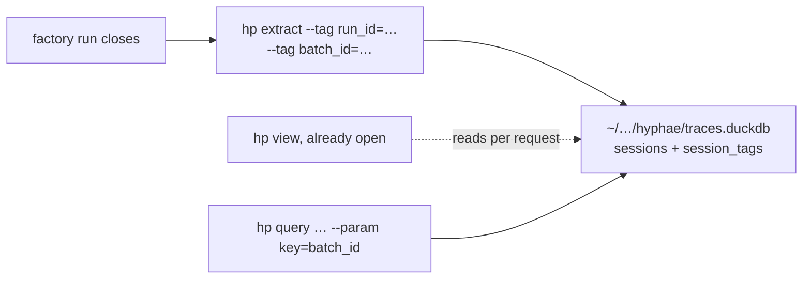

# Design: one per-user store, and tags on a session

Give `hp` one default store outside any checkout, let `hp extract` stamp a session with tags a caller chooses, and confirm that an extract lands while a viewer is open on the same store. Three small changes, made together because they are what software-factory needs to extract every run as it closes and to view it from any directory.

The factory's side is `plans/live-runs/design.md` in its repository. File references describe the current tree; verify them before each slice.

## Problem

`DEFAULT_DB` is `data/traces.duckdb` relative to the working directory (`src/hyphae/cli.py`), so every checkout has its own archive and a command run from elsewhere finds none. A caller with many transcripts to file under one name — a batch of factory runs, an experiment — has nowhere in the schema to write that name: `sessions` carries the transcript's own facts and nothing the caller knows. And a viewer left open on the store has never been shown, by a test, to leave room for an extract.

The constraint: the store is an archive. A path change must not orphan an existing `data/traces.duckdb` silently, and a new table must ride the migration path `test_duckdb__migrations.py` proves.

## Call paths, current → proposed

Current: `_add_db_argument` gives every store-taking subcommand `--db` defaulting to `DEFAULT_DB`; `_extract` builds `DuckDbExporter(args.db, wait=CLI_WAIT)` and the exporter's write replaces, per session id, every row in `TABLES` inside one transaction.

Proposed:

- `hyphae.store_path.default_store()` returns `Path(os.environ["HP_DB"])` when set, else `platformdirs.user_data_path("hyphae") / "traces.duckdb"`. `_add_db_argument` defaults to it; the help line prints the resolved path so a reader sees where their archive is
- `hp extract` takes `--tag KEY=VALUE`, repeatable. The parsed pairs travel on the extractor as `tags: Mapping[str, str]`, which fills `SessionTrace.session_tags`, and the write inserts them into `session_tags` beside the other rows of that session, under the same delete-then-insert. A tag is a property of the extraction, so a re-extract without `--tag` clears it: that is what "replaces" means for every other table, and a caller who wants a tag kept passes it again
- `session_tags` is one more entry in `TABLES`, so the replace loop and the migration path pick it up; `SCHEMA_VERSION` steps by one with a migration that creates the table
- The macros gain `tagged(key, value)`: a session-id set for the query library to join on, so a query takes `--param key=… --param value=…` rather than each query re-writing the join
- One locking test opens the store the way a viewer page does, read-only under `PAGE_WAIT`, holds the connection, and runs an extract under `CLI_WAIT` against it: the extract lands, or the failure names which side has to yield



## File-tree diff

```
src/hyphae/
  store_path.py          added: default_store(), HP_DB, the platformdirs call
  cli.py                 changed: DEFAULT_DB gone; --tag on extract; --db help prints the resolved path
  export/duckdb.py       changed: session_tags in _SCHEMA and TABLES, SCHEMA_VERSION + 1, a migration step
  extract/claude_code.py changed: ClaudeCodeExtractor(tags=…) fills SessionTrace.session_tags
  analyze/macros.py      changed: tagged(key, value)
  analyze/queries/       changed: one query that filters by tag, as the library's example
docs/store.md            changed: where the store lives, HP_DB, what a tag is and who writes it
CONTEXT.md               changed: Tag
tests/
  test_store_path.py     added
  test_cli.py            changed: --tag parses; the store flag test still holds
  export/test_duckdb.py  changed: tags written, replaced, cleared on a re-extract without them
  export/test_duckdb__locking.py   changed: an extract under an open viewer connection
  export/test_duckdb__migrations.py   changed: the new step is one the older-store test crosses
pyproject.toml           changed: platformdirs
```

## Key contracts

```python
# store_path.py
HP_DB = "HP_DB"
def default_store() -> Path:
    """The one archive `hp` reads and writes unless `--db` says otherwise: `$HP_DB`, else the
    user data directory platformdirs names for `hyphae`, with `traces.duckdb` in it."""

# export/duckdb.py — _SCHEMA
CREATE TABLE IF NOT EXISTS session_tags (
    session_id VARCHAR NOT NULL,
    key VARCHAR NOT NULL,
    value VARCHAR NOT NULL,
    PRIMARY KEY (session_id, key)
);
# TABLES gains  "session_tags": TableSpec(SessionTag, session_key="session_id", order=("key",))
# model.py gains SessionTag(session_id, key, value); SessionTrace gains `session_tags`, filled
# from the exporter's `tags` argument rather than from the transcript

class DuckDbExporter:
    def export(self, trace: SessionTrace, *, tags: Mapping[str, str]) -> ...   # or wherever the
    # per-session write is called; the pairs are the caller's, so no default

# cli: hp extract <project> [--projects-root …] [--db …] [--tag KEY=VALUE]...
# A KEY with no "=" or an empty KEY is a parse error, like --param's

# macros.py
CREATE OR REPLACE TEMP MACRO tagged(k, v) AS TABLE
SELECT session_id FROM session_tags WHERE key = k AND value = v;
```

The tag keys the factory writes are `run_id`, and for a batch's run `batch_id`, `set`, `task` and `profile`. Hyphae reserves none of them: a key is the caller's word.

## Chosen test seam

The exporter and the store: `DuckDbExporter` writing a fixture trace into a temporary store, then reads with a bare connection, as `tests/export/test_duckdb.py` does today. The CLI's `--tag` is tested at the parser, as the other flags are in `tests/test_cli.py`. `default_store` is tested with `monkeypatch` on the environment and on `platformdirs.user_data_path`.

## Slices

1. **The store path.** `store_path.py`, `platformdirs`, the `--db` default and its help line, `docs/store.md`. Verified by `test_store_path.py` and by `hp query --list` from a directory with no `data/`.
2. **Tags.** The table, the model, the write, the migration step, `--tag`, the macro and the one example query, `docs/schema.md`. Verified by the exporter tests: written, read back through `tagged`, replaced, and cleared on a re-extract without them; the migration suite crossing the new step.
3. **Extract under a viewer.** The locking test. If it fails, the fix is on hyphae's side and the factory's close waits on it.

## Decisions

- **`platformdirs` for the default**, with `HP_DB` above it. Rejected: `~/.hyphae/traces.duckdb`, a path one tool invents where every tool on the machine has one convention already.
- **A table, not a column.** Tags are many per session and the keys are the caller's. Rejected: a JSON column on `sessions`, which no macro can index and every query would parse.
- **Tags replaced with the session.** Every other table is replaced per session on re-extract, and a second rule for one table is a rule someone forgets. Rejected: merging, which lets a stale tag outlive the extraction that wrote it.
- **No new `hp tag` command.** The factory tags at extract; a later caller who needs to tag after the fact can ask. Rejected: building it now.
- **The old `data/traces.duckdb` is not moved.** `--db data/traces.duckdb` reads it as before, and `docs/store.md` says so. Rejected: a migration that copies the file, which silently doubles an archive.

## Out of scope

- A tag filter in the viewer's session list: a URL parameter on `/sessions` once a tagged store exists to design against
- Reading factory's `run.json` for tags: the factory passes them, hyphae reads no other tool's record
- Extracting Codex or pi transcripts: still Claude Code only

## Open questions

- ~~**Where the exporter takes tags.**~~ Settled in slice 2: the extractor takes them and fills `SessionTrace.session_tags`. `StoreSource.extract` rebuilds a trace from every `TABLES` entry, so the field is mandatory on the model either way; giving the exporter a second source for one table would leave that field written by one path and read by another, and the store→OTLP round trip would lose its tags.
- **`platformdirs` on macOS** names `~/Library/Application Support/hyphae`. Fine for an archive; confirm the factory's deny-list entry uses the same path.
