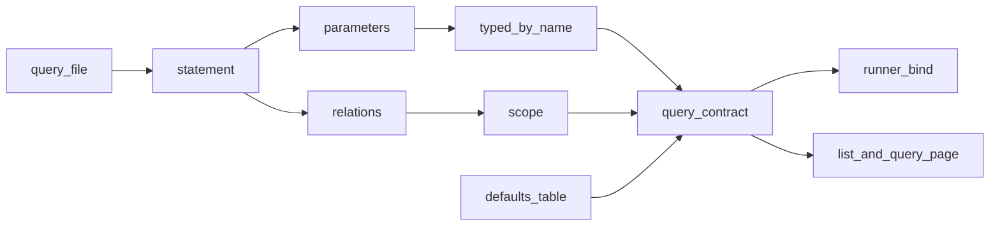

# Design: the statement is the query's declaration

The runner, `hp query --list` and the Query page read a query's parameters and scope off its `.sql` statement instead of a hand-written entry. `src/hyphae/view/manifest.py` is deleted; `src/hyphae/analyze/manifest.py` shrinks to the one fact a statement cannot state about itself, its production defaults. No header grammar is added: the SQL already says what it binds and what it reads.

This reopens audit S33 and C35 (`plans/refactor-audit-2026-08-30/findings.md`), which split the manifest into two Python modules and settled on one `SIZE` spelling. The split was right for what it knew; S34, landed in the same batch (`58abd2d`), is what changed the picture. Once no `view_*` parameter declares a default, the viewer's half says nothing its 38 statements do not.

## Problem

The library is 66 files: 28 analysis queries (22 corpus, 6 keyed) and 38 viewer queries, all keyed, binding 134 parameters between them with no defaults. Each has an entry in one of two manifests, and the entry restates three things the statement already holds — the name, the `$parameters`, and whether it reads `project_sessions` or `session_period` — plus two it does not: each parameter's type, and a default or `REQUIRED`.

The card says a missing entry "is found by the runner refusing at bind time". It is not. `tests/analyze/test_queries.py` already derives the name set (`NAMES`), the parameter set (`declared_parameters`) and the corpus-read rule (`relations`) from the files and holds the manifest to them, so a drifted entry fails `mise run check` before it merges. The history agrees: of the 109 commits that touched a statement or a declaration, 54 changed both together, and none is a bug fix for a mismatch. The mirror does not drift; it costs a second edit per query, and a test whose only job is to compare two copies of one fact.

The deletion test decides the shape. Delete the restated half and nothing is lost: scope by the `relations` rule matches the declared scope on 66 of 66 files, and the parameter names are the statement's. Delete the types and `--param k=v` cannot be parsed; delete the defaults and a committed report has nothing to quote (`docs/analysis.md`: "`src/hyphae/analyze/manifest.py` defines the production defaults that committed reports quote"). Those two stay in Python. The type turns out to be a fact about the name, not the query: 69 parameter names, none typed two ways.

## Call paths, current → proposed

Current: `runner.run` does `manifest.QUERIES.get(name)`, where `QUERIES = ANALYSIS | VIEW_QUERIES` is 66 hand entries; `cli._query_listing`, `view/pages/query/routes.py` and `tests/view/test_bounds.py` read the same dict. `queries.load(name)` reads the file separately.

Proposed: `runner.run` calls `manifest.describe(name)`, which loads the statement, strips comments, and builds the same `Query`: scope is `CORPUS` when `relations(statement)` meets `runner.CORPUS_RELATIONS`, and each `$parameter` gets `Param(type=PARAM_TYPES[parameter], default=DEFAULTS[name].get(parameter, REQUIRED))`. `_resolve`, the listing and the route keep their code; the dict they iterated becomes `manifest.catalog()`.



## File-tree diff

```
src/hyphae/analyze/
  queries.py       ~ + PARAM_TYPES, statement(), parameters(), relations(); - SESSION_ID..NODE_KIND, LOG_CHARS_PARAM, DRAW_SEED
  manifest.py      ~ ANALYSIS → DEFAULTS (17 queries, 43 values, comments kept); + names(), describe(), catalog(); - QUERIES
  runner.py        ~ describe() in place of QUERIES.get; CORPUS_RELATIONS is what scope is read against
  queries/view_*.sql  ~ headers take the rationale lines `view/manifest.py` held that the file lacks
src/hyphae/view/
  manifest.py      - deleted
  bounds.py, pages/query/routes.py, cli.py  ~ references
tests/analyze/
  test_queries.py  ~ NAMES/statement/relations/declared_parameters import from queries; two mirror leaves deleted; corpus-views leaf reshaped
  test_query.py    ~ planted queries are planted as files; --list order re-pinned; + untyped parameter and orphan default crash
tests/view/test_bounds.py  ~ catalog() where QUERIES was
docs/analysis.md, CONTEXT.md  ~ one sentence each
```

## Key contracts

```python
# analyze/queries.py
PARAM_TYPES: dict[str, ParamType]            # one type per parameter name, library-wide
def statement(name: str) -> str              # the SQL with its comments cut; moves from the test module
def parameters(statement: str) -> tuple[str, ...]   # $names, first appearance first
def relations(statement: str) -> set[str]    # the identifier after each FROM or JOIN

# analyze/manifest.py
DEFAULTS: dict[str, dict[str, ParamValue]]   # production defaults by query; a query absent here has none
def names() -> list[str]                     # the directory's stems, sorted
def describe(name: str) -> Query             # raises QueryError: no such file; a $parameter PARAM_TYPES lacks;
                                             #   a DEFAULTS key the statement does not bind
def catalog() -> dict[str, Query]            # describe() over names()
```

`Query`, `Param`, `Scope`, `REQUIRED` and `ParamValue` keep their shapes: they are what the runner, the listing, the route and the bounds tier consume, and this change moves where a `Query` comes from, not what it is. `describe` reads on demand rather than at import, so a test that plants a file under a patched `QUERY_DIR` is describing the real thing.

## Chosen test seam

The `hp query` command through `tests/analyze/conftest.py:QueryRunner`, and `describe(name)` over every shipped file in the smoke tier. The two planted-query leaves in `test_query.py` (the unknown `ParamType`, the DDL refusal) write a `.sql` into the patched `QUERY_DIR` instead of patching `manifest.QUERIES`: the planted statement is its own declaration. `test_every_query_file_has_a_manifest_entry` and `test_the_manifest_declares_exactly_the_parameters_the_sql_uses` are deleted, not rewritten — each would compare a derivation with itself. `test_a_cross_session_query_counts_through_the_corpus_views` keeps its live_/base-table rule under the derived scope.

## Slices

1. **Scope is read off the statement.** `relations` and `statement` move into `queries.py`; `describe` derives `Query.scope`; `scope=` leaves all 66 entries, which become parameter maps. Verified by the `--list` leaf still printing `corpus` for `agent_types`, the runner's `--project` refusals, and the reshaped corpus-views leaf.
2. **Parameters are read off the statement.** `PARAM_TYPES`; `view/manifest.py` deleted and its rationale moved to the headers that lack it; `ANALYSIS` becomes `DEFAULTS`; the shared `Param` constants go; the planted-query leaves plant files; the two mirror leaves go; the two crash leaves and the `--list` re-pin land; every path that named `view/manifest.py` is updated, because `check-fast` reports a path that does not resolve. Verified by the smoke tier over 66 files and `mise run check`.

## Decisions

- **The statement is the declaration; no header grammar.** Rejected: the card's header of scope, params and widths — a parser for facts the SQL states already, and a home for the default that `docs/analysis.md` puts in Python
- **Defaults stay in `analyze/manifest.py`, with their comments.** Rejected: defaults in headers — a default is the one number a report quotes that is not the query, and 43 of them carry the reasoning a reader of `DEFAULTS` reads first
- **A parameter's type is the name's, library-wide.** Rejected: per-query types (the mirror again) and inference from `::` casts (6 of 56 parameterized files cast anything). 69 names, none typed two ways, is the evidence
- **Scope by the suite's `relations` regex.** Rejected: walking `json_serialize_sql`'s AST, which fails on `missing_file_recovery` (a `:` it cannot parse). The regex has held 66 of 66 since the smoke tier was written
- **Derive on demand.** Rejected: a module-level scan — 66 reads on every import of a module the viewer app imports, and a registry the planted-query leaves would have to rebuild
- **`--list` names required parameters in statement order.** Rejected: alphabetical, which puts `chip_chars` before `session_id` everywhere; manifest order no longer exists. `view_runs` re-pins to `chip_chars session_id`

## Out of scope

- How the viewer composes its bindings (`view/store.py:page_rows`, audit C3): nothing here reads a default for a page
- The citation line and the Query page's rendering are unchanged; the page's 404 for an unknown name now comes from `names()`
- `Scope` as an enum and the runner's `project_sessions` build are unchanged; only where the scope comes from moves
- A header grammar for facts a future query may need (a boolean type, a list): when one arrives, `PARAM_TYPES` and `_parse` grow together, as `test_a_parameter_type_nothing_binds_is_refused_rather_than_bound_to_null` already anticipates

## When the library moves

A new query is one file. Its parameters bind under the types their names already carry; a new name with no type fails `describe` at the smoke tier and at `hp query` alike, naming the parameter. A default left behind by a parameter the statement dropped fails the same way. A statement that starts reading `session_period` becomes corpus on the next read, with no entry to forget.

## Designed against

The query directory on `main` at 2026-09-03: 66 files, and the two manifests as they stand after `58abd2d`. The scope, type and co-change counts above were computed over that tree; treat them as hypotheses to re-run at implementation.

## Open questions

- Whether the 43 comment lines in `view/manifest.py` move into headers or are cut where the header already says it (`view_offload` and `view_nav_tree_tools` already do; the implementer diffs the rest)
- Whether a library-wide type per parameter name is a constraint Nathaniel accepts: a future query wanting `level` as an integer would need another name
- Whether `--list` should sort required keys before sizes instead of statement order; `PARAM_TYPES` makes that possible (TEXT before INTEGER) if the re-pin reads wrong

## Glossary changes

Add to `CONTEXT.md` under **Pipeline**:

- **Library** — the query files in `analyze/queries/`: each statement declares its own parameters and scope, and a production default is the one fact declared beside it in Python
- **Scope** — corpus or keyed: whether a statement reads the `project_sessions` the runner builds from `--project`
