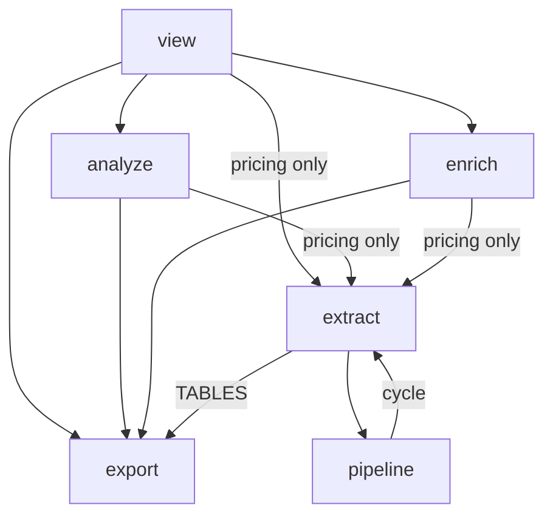
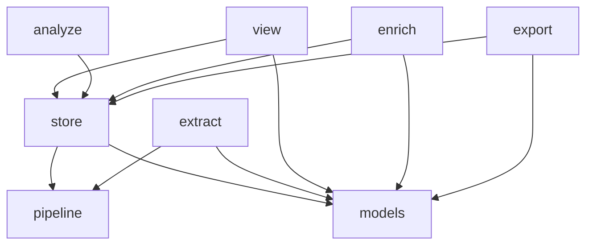

# Store layering: one package owns every read and write

Reorganize `src/hyphae` so `store` owns every query and write to DuckDB, `models` owns types crossing package lines, and an import linter enforces the layering. The package stays one distribution. An agent working on one area loads one directory's context; the SQL a page or pass depends on gets one home with its own tests.

This is the top document. Each phase has its own design linked below, written to the format in `.claude/skills/design`. Every path and count here was read on 2026-09-16; treat each as a hypothesis to check at the file before acting on it. The measurements behind the viewer decision are in [the numbers section](#the-numbers-behind-the-viewer-decision).

## Principles

- **Enabling refactors first.** Each phase leaves the tree in the shape the next phase needs, and each stays green on its own. Cheap moves that cut edges come before heavy ones.
- **One refactor per PR.** A PR moves one seam or renames one thing. Moves and renames never share a PR with behaviour changes.
- **No rendered byte changes** except where a phase document says so. The Python tier's page-bound tests and the browser tier are the oracle.
- **Enforce before moving.** Import Linter goes in at phase 0, over today's layering, so later phases cannot regress what an earlier one bought.
- **Models are a continuum.** A repository returns the variant a caller needs, with variants deriving from one another by inheritance rather than copied fields. `Session` is the entity, `SessionRollup` adds counts, and a listing may need less. Rendering may consume a shaped result rather than the whole trace, because the whole trace costs what the numbers below show.

## The shape at the end

```
src/hyphae/
  cli.py                 wires the packages together; imports everything
  models/                every type that crosses a package line: the trace entities, their variants, the enrichment vocabulary
  store/                 the trace store: schema, writer, reader, the SQL library, and one repository per area
  extract/               transcripts in, `SessionTrace` out; touches no database
  export/                OTLP only; reads the store through a repository
  enrich/                prompts, the LLM client; reads and writes through the enrichment repository
  analyze/               the manifest and runner behind `hp query`; every statement it runs lives in the store
  view/                  pages, page models, markup; every read goes through a repository
  pipeline.py            the extractor ↔ exporter contract, owning the errors it catches
  projects.py  pricing.py  settings.py  store_path.py    leaves
```

Arrows run from the importer to what it imports. `cli` imports every package and is left off. Leaf modules that any package may import (`models`, `projects`, `pricing`, `settings`, `store_path`) are omitted except where an edge to them is the point.

Today, verified by grep on 2026-09-16 (`rg '^\s*(from|import) hyphae\.' src/hyphae/<pkg>` per package):



This is the snapshot the plan was written against. From PR 0.3, `mise run cogs` generates the live version into `docs/layering.md`, so the current graph is read there rather than redrawn here.

At the end:



Three edges in today's graph exist only for the price table, and one is a cycle. Phase 0 removes all four for the price of two small moves, which is why it goes first.

## Phases and PRs

| Phase | Document | PRs | Stacks on | What it buys |
| --- | --- | --- | --- | --- |
| 0 | [Enforcement](phase-0-enforcement.md) | 0.1 cycle, 0.2 price table, 0.3 linter and graph | 0.1 and 0.2 are siblings off `main`; 0.3 stacks on both | The layering is a gate and a generated diagram; three cross-package edges gone |
| 1 | [Models](phase-1-models.md) | 1.1 `models/` package, 1.2 enrichment vocabulary, 1.3 dataclass or pydantic | 1.1 on phase 0; 1.2 on 1.1; 1.3 on 1.2, optional | The viewer stops importing `enrich`; the types have one home |
| 2 | [The store package](phase-2-store-package.md) | 2.1 writer and schema, 2.2 reader, 2.3a items and stamp types, 2.3b enrichment tables, 2.4 delivery ledger | Each on the previous | Only `store`, `view` and `analyze` import `duckdb`; `extract` and `export` no longer touch each other |
| 3 | [The SQL library](phase-3-sql-library.md) | 3.1 library and macros, 3.2a the viewer's own widths and params, 3.2b the fetch helpers, 3.3 the `Store` handle | Each on the previous | Only `store` imports `duckdb`; the viewer stops importing `analyze`; the graph reaches its final shape |
| 4 | [Repositories](phase-4-repositories.md) | 4.0 the enabling refactor; 4.1 sessions and projects; 4.2 records and offload; 4.3 failures; 4.4 analysis; 4.5 enrichment; 4.6 node headers and details; 4.7 node children and numbers; 4.8 NavTree and walk | 4.0 then 4.1 alone; the rest are siblings off `main`, with 4.6 → 4.7 → 4.8 one stack | The viewer's `read.py` files call typed methods; the query enums shrink to nothing |
| 5 | [Close-out](phase-5-closeout.md) | 5.1 the alias and the roster; 5.2 the handle's privacy and the documents; 5.3 the contract and the hook; 5.4 the renames | 5.1–5.3 siblings off `main`; 5.4 after all | No store module exports a dict type a page takes, the handle's verbs are private, the contract holds the graph the code draws, and the glossary, the layout tree and `docs/store.md` say what the code does |

Phases 0 to 3 are sequential. Each phase's PRs stack in the listed order, and a phase opens once the previous phase lands on `main`. Phase 4 fans out: its PRs are independent, so several can run at once in separate worktrees.

When a phase lands, run `mise run cogs` and compare the graph in `docs/layering.md` with the phase's after diagram. A difference is a finding to settle before the next phase opens.

## Landing rules

The repo lands branches on `main` by fast-forward only (`CLAUDE.md`, "Keep branches and commits focused"). That rule matters more with a stack:

- Land the bottom of a stack with a local fast-forward (`git push origin <branch>:main`). A squash or rebase-and-merge rewrites the SHAs the next PR's branch descends from, and GitHub then closes the next PR when the merged branch is deleted.
- Never delete a branch another open PR still bases on.
- Rebase the rest of the stack onto `main` after each landing, then force-push each branch.
- `gh stack` is optional. If used, note that it pins every member's base to the stack object and refuses `gh pr edit --base`; `gh stack unstack` releases the PRs without closing them.

Each PR carries the phase document's design in its body, per `docs/pull-requests.md`. This directory is committed on the phase 0.1 branch and must not remain untracked on `main` after that.

## Gates every phase runs

- `mise run check` must be green before every PR.
- `mise run lint-imports`, added in 0.3 and part of `check-fast` from then on. Each phase document says which contract it tightens.
- `mise run cogs` after a phase lands and after any change to `tools/gen_layout.py`. `docs/layering.md`'s graph is generated from the imports, and `CLAUDE.md`'s layout tree from package docstrings, so a new package needs its docstring and its entry.
- `mise run diagram-check <file>` on any document whose diagram changed.
- `CONTEXT.md` gets any term coined by a phase, in the same PR.

## The numbers behind the viewer decision

Measured on 2026-09-16 against the real store at `~/.hyphae/traces.duckdb` (647 sessions, read-only), using the reader in `src/hyphae/extract/store.py` to load sessions into `SessionTrace` instances. Test scripts ran in `/tmp` and were not kept.

| Read | Time |
| --- | --- |
| Full load, median session | 4ms |
| Full load, p90 | 22ms |
| Full load, largest session (11,264 api calls, 46,536 records) | 316 to 412ms |
| Largest session, entity tables only, no `raw_records` or `offload_files` | 105ms |
| One paged query, 25 api calls of the largest session | 2ms |
| Full load of all 647 sessions | 7.9s |

Loading the whole trace is affordable for a single session except in the tail, but prohibitive for cross-session pages. Repositories therefore offer both: entity reads that return `models` types, and shaped reads that return a variant sized for the page. The viewer takes shaped reads by default. The write path, OTLP export, and whole-session analysis take the full trace.

## Out of scope

- Separate installable packages or a uv workspace. Decided against on 2026-09-16: a workspace member cannot stop another member importing it, so it enforces less than the linter and requires renaming every import.
- Splitting `view` into rendering and web. A page's routes and markup change together. The page-first layout in `plans/view-layout/design.md` stays, and the boundary this plan enforces is `view → store`.
- A read-only repository variant. `open_trace_store` already takes `read_only`; a second class would guard against nothing today.
- Changing what any page renders, what any query returns, or the store schema.
