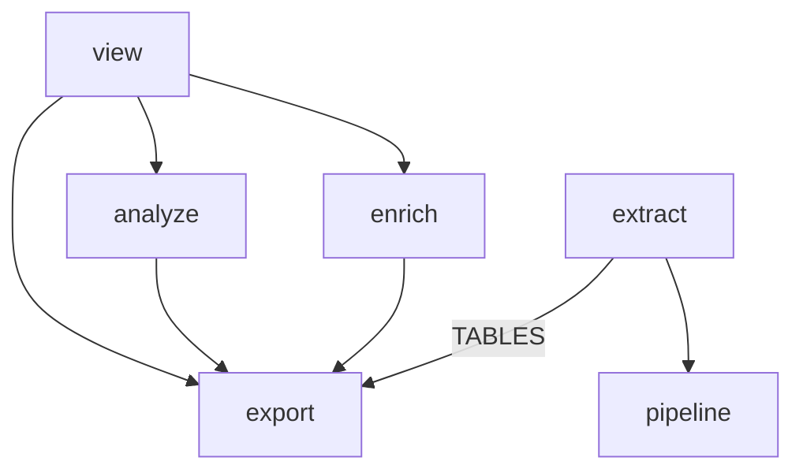

# Phase 0: enforce the layering that exists

Make the import graph a gate before anything moves, and generate the diagram that tracks it. Two small fixes come first so the gate can pass: break the tree's only import cycle, and move the price table that three packages reach into `extract` for.

Back to [the overview](overview.md).

## Problem

Nothing holds the layering today. `pipeline.py:13` imports `TranscriptSchemaError` from `extract.errors`, while `extract/claude_code.py:42` and `extract/store.py:23` import `pipeline`. The contract module ends up depending on one implementation of the contract.

Six files import `extract/pricing.py`: `analyze/macros.py:16`, `enrich/cost.py:18`, `view/pages/node/numbers.py:20`, `view/pages/node/reads.py:14`, `cli.py:47`, and `extract/parse.py:20`. For the five outside `extract`, this table is the only reason the package imports `extract`. A layers contract will fail immediately until both issues are fixed, and both fixes are worth doing on their own.

## Call paths, current → proposed

```
current:  pipeline.refresh ─catches─ extract.errors.TranscriptSchemaError
          analyze.macros / enrich.cost / view.pages.node.* ─import─ extract.pricing

proposed: pipeline.refresh ─catches─ pipeline.ExtractionError; extract.errors.TranscriptSchemaError subclasses it
          analyze.macros / enrich.cost / view.pages.node.* ─import─ hyphae.pricing
          mise run check / check-fast ─runs─ lint-imports over pyproject's [tool.importlinter]
          mise run cogs ─runs─ tools.gen_imports over grimp's graph, into docs/layering.md
```


## File-tree diff

```
src/hyphae/
  pipeline.py            + ExtractionError, the base the loop catches; no import from extract
  extract/errors.py      ~ TranscriptSchemaError(pipeline.ExtractionError); SessionLayoutError(Exception); the old root goes
  pricing.py             ← extract/pricing.py, unchanged inside
mise.toml                + [tasks.lint-imports], in check and check-fast
tools/gen_imports.py     + the package graph as Mermaid, built with grimp; omits `cli` and the leaves; writes its own fence, as gen_layout does
tools/gen_layout.py      ~ an entry for docs/layering.md
docs/layering.md         + which package may import which: the cogged graph, and what the contract holds
pyproject.toml           + import-linter in the dev group; + [tool.importlinter]
tests/test_pipeline.py   ~ two leaves: an extractor raising the base lands in `failed`; a layout error still ends the pass. The schema-error leaf asserts a string and needs no edit
tests/extract/test_claude_code__archive.py
                         ~ a layout error is not the class refresh catches
tests/test_pricing.py    ← tests/extract/test_pricing.py, if one exists there; check
CONTEXT.md               ~ the Price table entry names `src/hyphae/pricing.py`
```

After PR 0.2, `analyze`, `enrich`, and `view` no longer import `extract` at all. Verify with the grep in the overview before writing the contract.




## Key contracts

The initial `[tool.importlinter]` configuration must pass on the tree left by phase 0:

```toml
[tool.importlinter]
root_package = "hyphae"

[[tool.importlinter.contracts]]
name = "Layers"
type = "layers"
containers = ["hyphae"]
exhaustive = true
layers = [
  "cli",
  "view",
  "analyze | enrich",
  "extract",
  "export",
  "pipeline",
  "user_settings",
  "model | projects | pricing | settings | store_path",
]
```

`exhaustive = true` carries forward. Every new module must pick a layer, and later phases edit this list instead of adding rules beside it. `extract` sits above `export` only because of the `TABLES` import, which phase 2 removes. `user_settings` takes its own line because `|` means independent, and it imports `store_path`.

`docs/layering.md` holds one cog block, `uv run python -m tools.gen_imports`, printing the direct imports between the children of `hyphae` as a Mermaid graph in the overview's convention: an arrow from the importer to what it imports, `cli` and the leaf modules left off, no edge labels. The generator builds the graph with grimp, the library Import Linter runs on, so the diagram and the contract read the same imports. A cog marker inside a fence is an example rather than a live block, so the generator writes the fence itself, as `gen_layout` does. `cogs-check` in `check` fails when the diagram lags the code.

## Chosen test seam

`mise run lint-imports` is its own test: it is red on `main` before PR 0.1 lands, and green after; the pricing edges point downward, so only the grep proves PR 0.2. `tests/test_pipeline.py` drives `refresh` over an extractor that raises the base class directly, and over a corpus whose layout it cannot read, so the catch is held to exactly one class. The rest of the suite is unchanged; PR 0.2 only moves a file.

## Slices

1. **PR 0.1, the cycle.** Add `ExtractionError` to `pipeline.py`: the one class `refresh` catches. In `extract/errors.py`, `TranscriptSchemaError` subclasses it, `SessionLayoutError` stands alone on `Exception`, and the extract-level `ExtractionError` goes, since nothing caught it. The catch does not widen: a layout error still ends the pass. Verify: `rg 'hyphae.extract' src/hyphae/pipeline.py` is empty; `mise run check` passes.
2. **PR 0.2, the price table.** Run `git mv src/hyphae/extract/pricing.py src/hyphae/pricing.py`. Update every importer, the two comments in `model.py:119` and `view/nodes.py:147,660`, and `CONTEXT.md`. Verify: `rg 'extract.pricing' src tests tools docs` is empty; `mise run check` passes.
3. **PR 0.3, the gate and the graph.** Add the dependency, the contract above, `lint-imports` in `check` and `check-fast`, the generator, and `docs/layering.md` with its cog block. Verify: `mise run check-fast` is green; comment out one layer line and watch it go red; `mise run cogs` writes a graph equal to the after-phase-0 diagram above, and `mise run diagram-check docs/layering.md` accepts it.


## Decisions

- **Choose Import Linter over Tach and uv workspaces.** Tach has `tach test` but changed hands in 2025. A uv workspace cannot stop one member from importing another. Researched 2026-09-15.
- **Define the base error in** `pipeline.py` **instead of a new** `errors.py`**.** Only the refresh loop catches it, and a module with one class is a shallow module.
- **Leave** `SessionLayoutError` **on** `Exception`**, and drop extract's own root.** Only `TranscriptSchemaError` subclasses the pipeline base, so `refresh` catches exactly what it did before. Rejected alternatives: widening the catch to layout errors, which is a behaviour change — a directory we cannot read is a Claude Code change to look at, not a session to skip; and a second base under a new name beside the existing root, which nothing caught.
- **Put** `pricing.py` **at the top level beside** `projects.py`**, not in** `models/`**.** It is a reference table, and phase 1 keeps `models` to types that cross package lines. Rejected alternative: leave it in `extract` and let the contract allow the edge, which keeps three packages importing a parser just to read a constant table.
- **Generate Mermaid with grimp instead of committing** `import-linter drawgraph` **output.** `drawgraph` prints DOT for the same graph, but DOT does not render on GitHub, and a PNG cannot be diffed or held by `diagram-check`. It stays the one-off tool for a subpackage, such as `import-linter drawgraph hyphae.view` during phase 3.
- **Put the live graph in** `docs/`**, not in this plan.** `aigarden.toml` treats a plan as a historical document, and a cog block here would rewrite the plan's snapshot on every `mise run cogs` after the work ends. The phase diagrams stay hand-drawn targets; the doc holds the state.
- **Keep the name** `MODELS` **for now.** Renaming it to `PRICES` while a `models` package arrives in phase 1 is tempting, but belongs in a separate PR. It stays out of this stack because `CONTEXT.md`, `docs/`, and existing SQL comments all name it.


## Out of scope

- Moving anything into or out of `export`, `extract`, or `view`. Those changes wait for phases 2 and 3.
- `tests/conftest.py`, which imports across every area and stays the corpus builder for the whole suite.

