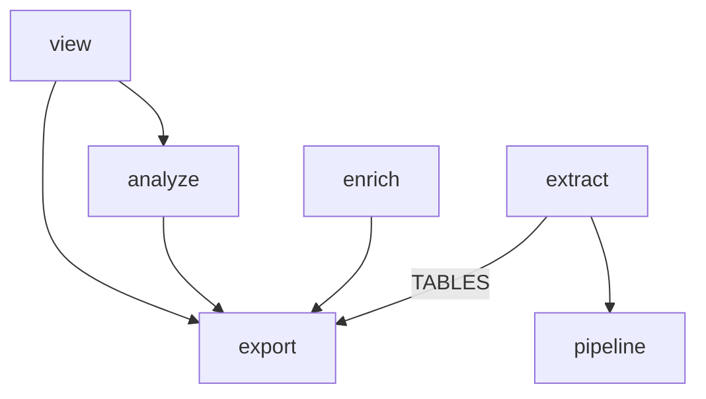

# Phase 1: the `models` package

Give types that cross package lines one home. Today's `model.py` moves in whole. The enrichment vocabulary the viewer imports from `enrich` follows it, and the question of dataclasses versus Pydantic gets its own optional PR.

Back to [the overview](overview.md). Stacks on [phase 0](phase-0-enforcement.md).

## Problem

`model.py` is 360 lines of frozen dataclasses, imported by `extract`, `export`, `enrich`, `pipeline`, and four viewer modules (for the constant `MAIN_SOURCE`). It is already the shared layer, but it is not named as one, and there is nowhere to put a second shared type. The viewer imports three symbols from `enrich` across four sites (`enrich.items.Level`, `enrich.levels.LEVELS`, and `enrich.stamp.Versions` at `view/enrichment.py:17-19` and `view/detail.py:18`). These define enrichment table vocabulary rather than behaviour, and they are the only reason `view` depends on `enrich`. Phase 4 will add result models, and they need a package that exists before they do.

## Call paths, current → proposed

```
current:  extract ─builds─ model.SessionTrace ─written by─ export.duckdb.DuckDbExporter
          view.enrichment ─imports─ enrich.items.Level, enrich.levels.LEVELS, enrich.stamp.Versions

proposed: extract ─builds─ models.trace.SessionTrace ─written by─ export.duckdb.DuckDbExporter
          view.enrichment ─imports─ models.enrichment.Level, LEVELS, Versions
          enrich ─imports─ the same three from models
```

## File-tree diff

```
src/hyphae/
  models/
    __init__.py          the package docstring gen_layout prints into CLAUDE.md
    trace.py             ← model.py: Session, Turn, ApiCall, ToolCall, AgentRun, OffloadFile, Compaction, PrLink, SessionTag, RawRecord, LiveRows, SessionTrace, MAIN_SOURCE
    enrichment.py        ← enrich/items.py:Level, enrich/levels.py:LevelSpec and LEVELS, enrich/stamp.py:Versions; verify at the file which of these are vocabulary and which carry behaviour
  model.py               deleted
tests/models/            ← tests in tests/ that test model.py directly; `rg 'hyphae.model\b' tests` finds them
tools/gen_layout.py      + Entry("src/hyphae/models/", Module("hyphae.models"))
pyproject.toml           ~ the layers list: "models | projects | pricing | settings | store_path"
CONTEXT.md               ~ the Telemetry section points at `src/hyphae/models/trace.py`
```



## Key contracts

- `models` imports nothing from `hyphae` except `pricing` (if a type carries a price), as the bottom layer of the import contract enforces.
- `models/trace.py` keeps every class, field, and docstring from `model.py`. PR 1.1 is `git mv` plus import rewrites, so `git log --follow` preserves history.
- `LEVELS` may not be pure vocabulary. In `enrich/levels.py:21`, `LevelSpec` states that it holds "what it sends the model, where its rows live, and what reads them". If a field holds a prompt or a query, it stays in `enrich`, and only the enum and stamp move. Decide at the file in PR 1.2.

## Chosen test seam

For file moves, the test suite is the oracle: it must stay green with only import lines changed. After PR 1.2, `mise run lint-imports` must pass with `enrich` removed from the layers `view` may reach, confirming the viewer's last `enrich` import is gone. Add a `forbidden` contract in PR 1.2: `hyphae.view` may not import `hyphae.enrich`.

## Slices

1. **PR 1.1: the package.** Run `git mv src/hyphae/model.py src/hyphae/models/trace.py`, add `__init__.py` with the package docstring, and rewrite `from hyphae.model import` across `src`, `tests`, and `tools`. Run `mise run cogs`. Verify: `rg 'hyphae\.model\b' .` is empty, and `mise run check` passes.
2. **PR 1.2: enrichment vocabulary.** Move `Level`, `Versions`, and whichever parts of `LEVELS` are vocabulary to `models/enrichment.py`. Update `enrich` and `view` to import from there, and add the forbidden contract. Verify: `rg 'hyphae.enrich' src/hyphae/view` is empty, and `mise run check` passes.
3. **PR 1.3 (optional): dataclasses to Pydantic.** Convert `models/trace.py` and the two call sites that build models positionally or via `dataclasses.fields`: `export/duckdb.py` and `extract/store.py:_read` (`spec.model(*row)`). Verify: export tests round-trip every fixture session through the writer and reader unchanged.

## Decisions

- **`models/trace.py` is one module, not one file per entity.** Twelve classes reference each other; splitting them into individual files would mean twelve imports just to read one trace. Rejected for the same reason `view` chose page-first over kind-first.
- **Vocabulary moves, behaviour stays.** A type moves to `models` when a second package needs it. A prompt version or a query never moves.
- **Pydantic belongs in a separate PR off the critical path.** Inheritance for model variants works with dataclasses too, so phase 4 does not require Pydantic. What Pydantic adds is validation where DuckDB rows become models, which `extract/store.py:_read` currently does by position without checks. Defer this change to the first phase 4 PR that builds a variant from a row, and decide with that concrete case in hand. The records layer already uses Pydantic (`extract/records/`), so the dependency is present either way.

## Out of scope

- **Result models and model variants.** Phase 4 adds them here, one per repository method family.
- **`pricing.py`.** Phase 0 placed it beside `projects.py`. It is a table, not a model.

## Open questions

- **Frozen dataclass inheritance.** A subclass that adds a field without a default after a base field with a default fails at class creation. Check whether any entity has defaults before designing a variant on it. If so, `kw_only=True` on the base fixes it: a one-line change in PR 1.1 while moving the file.
