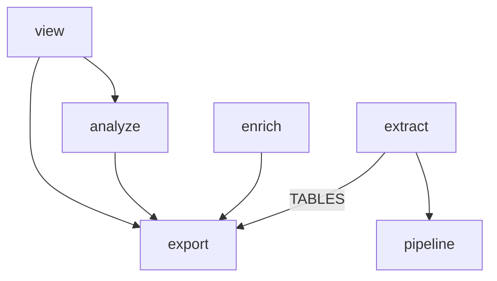

# Phase 1: the `models` package

Give types that cross package lines one home. Today's `model.py` moves in whole. The enrichment vocabulary the viewer imports from `enrich` follows it, and the question of dataclasses versus Pydantic gets its own optional PR.

Back to [the overview](overview.md). Stacks on [phase 0](phase-0-enforcement.md).

## Problem

`model.py` is 360 lines of frozen dataclasses, imported by `extract`, `export`, `enrich`, `pipeline`, and four viewer modules (for the constant `MAIN_SOURCE`). It is already the shared layer, but it is not named as one, and there is nowhere to put a second shared type. The viewer imports three symbols from `enrich` across four sites (`enrich.items.Level`, `enrich.levels.LEVELS`, and `enrich.stamp.Versions` at `view/enrichment.py:17-19` and `view/detail.py:18`), and they are the only reason `view` depends on `enrich`. Phase 4 will add result models, and they need a package that exists before they do.

The three symbols are not all vocabulary, and the viewer needs more of them than it imports. `view/enrichment.py:26` reads `LEVELS` only for each level's table name, but `LevelSpec` (`enrich/levels.py:21`) also carries a prompt subject, budgets, and a renderer bound to `enrich.prompts`. `Enrichment.stale` (`view/enrichment.py:70`) calls `Versions.current().moved_past(...)`, and `current()` reads `LEVELS[level].prompt_version` and `taxonomy.TAXONOMY_VERSION`. So a viewer that imports nothing from `enrich` has to reach the level's table name, the version each level's prompt is on, and the taxonomy version from a package under both. That constraint decides the cut: the declared versions are data and move with the vocabulary; the prompts and renders they version stay.

## Call paths, current → proposed

```
current:  extract ─builds─ model.SessionTrace ─written by─ export.duckdb.DuckDbExporter
          view.enrichment ─imports─ enrich.items.Level, enrich.levels.LEVELS, enrich.stamp.Versions
          enrich.stamp.Versions.current ─reads─ enrich.levels.LEVELS, enrich.taxonomy.TAXONOMY_VERSION

proposed: extract ─builds─ models.trace.SessionTrace ─written by─ export.duckdb.DuckDbExporter
          view.enrichment ─imports─ models.enrichment.Level, ROWS, Versions
          models.enrichment.Versions.current ─reads─ models.enrichment.ROWS, TAXONOMY_VERSION
          enrich.levels.LEVELS ─keyed by─ models.enrichment.Level; holds the prompt half only
          enrich.stamp.mint ─builds─ a Stamp from a models.enrichment.Versions
```

## File-tree diff

```
src/hyphae/
  models/
    __init__.py          the package docstring gen_layout prints into CLAUDE.md
    trace.py             ← model.py: Session, Turn, ApiCall, ToolCall, AgentRun, OffloadFile, Compaction, PrLink, SessionTag, RawRecord, LiveRows, SessionTrace, MAIN_SOURCE
    enrichment.py        ← enrich/items.py:Level; enrich/taxonomy.py whole (Category, Outcome, the two definition maps, TAXONOMY_VERSION);
                           enrich/stamp.py:Versions minus its stamp() method; + LevelRows and ROWS, the rows half of enrich/levels.py:LevelSpec and LEVELS
  model.py               deleted
  enrich/
    taxonomy.py          deleted
    items.py             ~ imports Level from models
    levels.py            ~ LevelSpec loses prompt_version, table, keys, base, base_keys; LEVELS keeps the prompt half, keyed by models.enrichment.Level
    stamp.py             ~ Versions gone; + mint(versions, level, rendered, model) -> Stamp, the method that left
    store.py             ~ reads table, keys, base, base_keys from models.enrichment.ROWS; reader still from LEVELS
    prompts.py, cost.py, enricher.py   ~ import lines
  view/enrichment.py, view/detail.py   ~ import lines; TABLES reads ROWS
  cli.py                 ~ import lines
tools/gen_layout.py      + Entry("src/hyphae/models/", Module("hyphae.models"))
pyproject.toml           ~ the layers list, once per PR (Key contracts)
CONTEXT.md               ~ Telemetry points at `src/hyphae/models/trace.py`; Enrichment's "the vocabularies" at `src/hyphae/models/enrichment.py`
docs/enrichment.md       ~ line 134 sends a maintainer to `levels.py` to bump `prompt_version`; retarget to models/enrichment.py
tests/                   ~ import lines, and the attribute paths PR 1.2 moves (Chosen test seam); no test tests model.py itself, so no tests/models/ directory
```



Edges to `models` are left off by the overview's convention: `extract`, `export`, `enrich`, `pipeline` and `view` all import it after PR 1.2, and nothing else does.

## Key contracts

- `models` imports nothing from `hyphae`. Its layer line lists it beside `projects`, `pricing`, `settings` and `store_path`, and `|` means independent, so it may not import those either. A type that one day carries a price changes the layers list then.
- `models/trace.py` keeps every class, field, and docstring from `model.py`. PR 1.1 is `git mv` plus import rewrites, so `git log --follow` preserves history.
- `models/enrichment.py` after PR 1.2 holds, beside `Level` and the taxonomy moved verbatim:

  ```python
  @dataclass(frozen=True)
  class LevelRows:
      """Where one level's rows live, and the prompt version this build writes them under.

      The half of a level a reader or writer needs with no prompt in hand. The prompt itself,
      its budgets and its render are `enrich/levels.py:LEVELS`, keyed by the same `Level`.
      """

      # Covers what a row's input hash cannot see: the level's instructions and output schema
      # in `enrich/prompts.py`. Bump it with them and the level re-enriches.
      prompt_version: int
      table: str
      keys: tuple[str, ...]
      base: str
      base_keys: tuple[str, ...]

  ROWS: dict[Level, LevelRows]   # the three entries today, values unchanged

  @dataclass(frozen=True)
  class Versions:
      prompt: Mapping[Level, int]
      taxonomy: int

      @classmethod
      def current(cls) -> "Versions":   # reads ROWS and TAXONOMY_VERSION, both in this module
      def moved_past(self, level, *, prompt_version, taxonomy_version) -> bool:   # unchanged
  ```

  `enrich/levels.py:LevelSpec` keeps `subject`, `budgets`, `renderer`, `reader`, `riders`. `enrich/stamp.py` keeps `Stamp`, `COLUMNS`, `input_hash`, `stale`, and gains `mint(versions: Versions, level: Level, rendered: str, model: str) -> Stamp`, which is `Versions.stamp` with the receiver made an argument; the one caller is `enrich/enricher.py:186`. The names `LevelRows`, `ROWS` and `mint` are the implementer's to improve; the split is not.
- The layers list. After PR 1.1, `model` becomes `models` on the bottom line. After PR 1.2, `enrich` moves up beside `view`, because two layers on one line may not import each other and that is the whole claim:

  ```toml
  layers = [
    "cli",
    "view | enrich",
    "analyze",
    "extract",
    "export",
    "pipeline",
    "user_settings",
    "models | projects | pricing | settings | store_path",
  ]
  ```

  `enrich` imports `export`, `models`, `pricing` and `projects` and nothing in between, so it sits above `analyze` as before. `exhaustive = true` still names every child of `hyphae`: `model` left, `models` arrived, nothing else changed.

## Chosen test seam

For file moves, the test suite is the oracle. PR 1.1 must stay green with only import lines changed. PR 1.2 changes import lines plus three attribute paths, and nothing else in a test: `LEVELS[level].prompt_version` and `spec.table` become `ROWS[level].prompt_version` and `ROWS[level].table`; `versions.stamp(...)` becomes `mint(versions, ...)`; and `tests/enrich/test_stamp.py:105` patches `ROWS[Level.turn]` instead of `LEVELS[Level.turn]`, still proving `current()` reads each level's own declaration. After PR 1.2, `mise run lint-imports` passes with the edited layers list, which is what says the viewer's last `enrich` import is gone; `rg 'hyphae.enrich' src/hyphae/view` empty says the same by hand.

## Slices

1. **PR 1.1: the package.** Run `git mv src/hyphae/model.py src/hyphae/models/trace.py`, add `__init__.py` with the package docstring, rewrite `from hyphae.model import` across `src`, `tests`, and `tools`, and change `model` to `models` in the layers list. Run `mise run cogs`. Verify: `rg 'hyphae\.model\b' .` is empty, and `mise run check` passes.
2. **PR 1.2: enrichment vocabulary.** Create `models/enrichment.py` with `Level`, the taxonomy, `LevelRows`, `ROWS`, and `Versions` as the contract above states; cut the five rows fields out of `LevelSpec`; turn `Versions.stamp` into `enrich/stamp.py:mint`; delete `enrich/taxonomy.py`; rewrite the importers in `enrich`, `view`, `cli`, and `tests`; move `enrich` up beside `view` in the layers list. Verify: `rg 'hyphae.enrich' src/hyphae/view` is empty, and `mise run check` passes, `lint-imports` included.
3. **PR 1.3 (optional): dataclasses to Pydantic.** Convert `models/trace.py`. Five sites read the entities through `dataclasses.fields()` or build them positionally: `extract/store.py:114` (columns from `fields(spec.model)`) and `:120` (`spec.model(*row)`), and `export/duckdb.py:221`, `:313`, `:569` (field names for the `replayed` check, `LiveRows` counting, and INSERT columns). The Pydantic form decides whether they change. `pydantic.dataclasses.dataclass` keeps `dataclasses.fields()` and positional construction, so all five survive untouched and the PR is the decorator swap plus validation; `pydantic.BaseModel` breaks all five and puts field-name reads on `model_fields`. Take the pydantic dataclass unless the phase 4 case that triggers this PR needs what only `BaseModel` gives (`model_validate` from a mapping, aliases, serializers) — that is the criterion, and it is decided with the case in hand. Verify: `tests/export/test_duckdb.py:test_a_trace_round_trips`, which already round-trips a fixture session through the writer and reader.

## Decisions

- **`models/trace.py` is one module, not one file per entity.** Twelve classes reference each other; splitting them into individual files would mean twelve imports just to read one trace. Rejected for the same reason `view` chose page-first over kind-first.
- **Vocabulary moves, behaviour stays.** A type moves to `models` when a second package needs it. A prompt or a query never moves. `LevelSpec` splits along that line: the rows half and the versions are data every reader needs; the subject, budgets, renderer and riders are the pass's alone. Rejected: moving `LEVELS` whole, which drags `enrich.prompts` into `models`; and keeping `LEVELS` whole in `enrich`, which leaves the viewer importing it for a table name.
- **The declared versions live in `models`, so `Versions.current()` stays a classmethod there.** The viewer's `stale` and, after phase 4, the store's enrichment repository both need today's versions, and neither may import `enrich`. With `prompt_version` on `LevelRows` and `TAXONOMY_VERSION` beside its taxonomy, `current()` reads its own module and the upward edge the audit found never exists. Rejected: `current()` as a free function in `enrich`, which nothing under `enrich` can call — the viewer would then need a `Versions` injected through `build_app`, `app.state`, `described()` and `Enrichment`, about fifteen `build_app` call sites in `tests/` and `tools/` with it, and later the repository too: an interface change in a move PR. The cost taken instead is that a level's prompt version is declared one package away from the prompt it versions; the `LevelRows` comment and `docs/enrichment.md` say where to bump it.
- **The taxonomy moves whole.** Only `enrich` imports `Category` and `Outcome` today, but `TAXONOMY_VERSION` must move (above), and the module's own docstring ties a member change to a bump of that version; splitting them puts the rule in two packages. `prompts.py` imports the definitions from `models` instead. Rejected: leaving `Category` and `Outcome` in `enrich` with the version alone in `models`.
- **`Versions.stamp` becomes `mint` in `enrich`, not a method that pulls `Stamp` along.** The method needs `Stamp` and `input_hash`, which only `enrich` uses today. Rejected: moving `Stamp`, `COLUMNS` and `input_hash` to `models` now — phase 2.3 moves `enrich/store.py` under `store`, which is when a second package needs `Stamp`, and that PR decides whether it lives in `models` or with the tables.
- **`view | enrich` on one layer line, not a `forbidden` contract.** The layers contract already says two layers on a line may not import each other, and phase 0 asked that later phases edit the list rather than add rules beside it. Rejected: the `forbidden` contract the first draft of this document proposed, which would state a second time what the list says once.
- **Pydantic belongs in a separate PR off the critical path.** Inheritance for model variants works with dataclasses too, so phase 4 does not require Pydantic. What Pydantic adds is validation where DuckDB rows become models, which `extract/store.py:_read` currently does by position without checks. Defer this change to the first phase 4 PR that builds a variant from a row, and decide with that concrete case in hand. The records layer already uses Pydantic (`extract/records/`), so the dependency is present either way.

## Out of scope

- **Result models and model variants.** Phase 4 adds them here, one per repository method family.
- **`pricing.py`.** Phase 0 placed it beside `projects.py`. It is a table, not a model.
- **`Stamp`, `COLUMNS`, `input_hash`, and `LevelSpec.reader`.** `enrich/store.py` reads all four, and phase 2.3 moves that module under `store`, which may not import `enrich`. Where each lands is that PR's call, with the store's tables in hand.
- **Injecting versions into the viewer.** The `Versions` docstring argues for passing over reading, and the enricher already takes one. The viewer reads `current()` today and keeps doing so; a repository that takes a `Versions` is a phase 4 shape to weigh against the byte-identical pages it must keep serving.

## Open questions

- **Phase 2's layers list.** `phase-2-store-package.md` Key contracts shows `view` alone above `analyze | enrich | export`, which would let `view` import `enrich` again. After this phase the line reads `view | enrich`, and phase 2 should carry that forward when it re-draws the list for `store`.
- **The overview's end-state tree** glosses `enrich/` as "prompts, taxonomy, the LLM client" and `models/` as holding "the enrichment vocabulary". After PR 1.2 the taxonomy is in `models`; the `enrich/` gloss wants "prompts, the LLM client".

Settled while revising: no entity in `model.py` has a defaulted field (checked with `dataclasses.fields` on every class on 2026-09-16), so a phase 4 variant can add fields to any of them without `kw_only=True`. Re-check at the file when the first variant is written.
