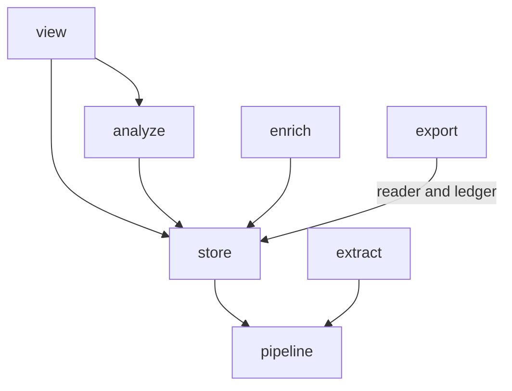

# Phase 2: the `store` package, by moves alone

Create `src/hyphae/store/` and move all existing storage code into it: the writer and schema from `export/duckdb.py` and `export/schema.py`, the reader from `extract/store.py`, the enrichment tables from `enrich/store.py`, and the delivery ledger from `export/otlp_delivery.py`. Nothing changes inside a moved module beyond its imports. At the end, `extract`, `export`, and `enrich` import no `duckdb`, and `extract` and `export` no longer know each other exist.

Back to [the overview](overview.md). Stacks on [phase 1](phase-1-models.md).

## Problem

Storage is spread across four packages, each holding whichever piece it needed first. `docs/store.md:33` notes that three modules create tables in the same file: `export/duckdb.py:_SCHEMA`, `export/otlp_delivery.py:_DELIVERY_SCHEMA`, and `enrich/store.py:_SCHEMA`. `extract/store.py` reads the store back as an extractor and imports `export.duckdb.TABLES` to do it, the only reason a parser imports an exporter. `plans/refactor-audit-2026-08-30/findings.md` S23 lists `TABLES` and `extract/store.py:ROW_ORDER` as duplicate registries across two packages. Anyone changing the schema has to find four files across three packages.

## Call paths, current → proposed

```
current:  cli ─opens─ export.duckdb.open_trace_store ─writes with─ export.duckdb.DuckDbExporter
          export.otlp_delivery.OtlpExporter ─reads─ extract.store.StoreSource ─records in─ export.otlp_delivery.DeliveryLedger
          enrich.enricher ─reads and writes─ enrich.store.EnrichmentStore

proposed: cli ─opens─ store.trace_store.open_trace_store ─writes with─ store.trace_store.DuckDbExporter
          export.otlp_delivery.OtlpExporter ─reads─ store.trace_reader.StoreSource ─records in─ store.delivery.DeliveryLedger
          enrich.enricher ─reads and writes─ store.enrichment.EnrichmentStore
```

## File-tree diff

```
src/hyphae/
  store/
    __init__.py          package docstring for the layout tree
    trace_store.py       ← export/duckdb.py: _SCHEMA, the views, TABLES, PAGE_WAIT, CLI_WAIT, StoreLocked, open_trace_store, DuckDbExporter, refresh_views
    schema.py            ← export/schema.py: SCHEMA_VERSION, MIGRATIONS, check_shape, table_ddl, SchemaVersionError
    trace_reader.py      ← extract/store.py: StoreSource and its three errors
    enrichment.py        ← enrich/store.py: EnrichmentStore, its _SCHEMA, RunLink
    delivery.py          ← export/otlp_delivery.py: DeliveryLedger, _DELIVERY_SCHEMA
  export/
    duckdb.py schema.py  deleted
    otlp_delivery.py     ~ keeps Backend, BackendSpec, OtlpCensus, OtlpExporter, the pacer; imports the ledger from store
  extract/store.py       deleted
  enrich/store.py        deleted
tests/store/             ← tests/export/test_duckdb*.py, tests/export/test_schema*.py, tests/extract/test_store.py, tests/enrich/test_store.py, and the ledger leaves from tests/export/test_otlp_delivery*.py; check each name at the file
tests/conftest.py        ~ imports `_SCHEMA` and `table_ddl` from store
tools/gen_routes.py      ~ imports from store
tools/gen_layout.py      + the store entry
pyproject.toml           ~ layers and a forbidden contract, below
docs/store.md            ~ paths only; the facts hold
CONTEXT.md               ~ the Store entry points at the package
```



## Key contracts

The layers list after 2.4, with `store` and `extract` side by side under `export`:

```toml
layers = [
  "cli",
  "view",
  "analyze | enrich | export",
  "store | extract",
  "pipeline",
  "models | projects | pricing | settings | store_path",
]
```

The first `forbidden` contract on the driver, with `include_external_packages = true`:

```toml
[[tool.importlinter.contracts]]
name = "Only the store and, until phase 3, the viewer and analyze speak DuckDB"
type = "forbidden"
source_modules = ["hyphae.extract", "hyphae.export", "hyphae.enrich", "hyphae.cli", "hyphae.pipeline", "hyphae.models"]
forbidden_modules = ["duckdb"]
```

`store` imports `pipeline` for `SessionSource`, because the reader is an extractor. It also imports `models`, `projects`, and `pricing`. It does not import `extract`; the reader rebuilds a trace from rows and never parses.

## Chosen test seam

Pure moves: the test suite stays green with updated import lines. Moved test files keep their names under `tests/store/`. Whichever scaffolding test pins the package list (`tests/tools/test_layout*` or `tests/test_scaffolding.py`; check with `rg 'extract.*export.*enrich' tests/test_scaffolding.py`) gets the new package.

## Slices

1. **PR 2.1: the writer and schema.** `git mv export/duckdb.py src/hyphae/store/trace_store.py` and `git mv export/schema.py src/hyphae/store/schema.py`. Rewrite imports in `cli`, `view/store.py`, `view/app.py`, `enrich/store.py`, `analyze/runner.py`, `extract/store.py`, `tools/gen_routes.py`, and tests. Verify: `rg 'export\.duckdb|export\.schema' .` is empty; `mise run check`.
2. **PR 2.2: the reader.** `git mv src/hyphae/extract/store.py src/hyphae/store/trace_reader.py`. `extract` now imports only `models`, `pipeline`, `projects`, and `settings`. Verify: `rg 'hyphae.export|hyphae.store' src/hyphae/extract` is empty; `mise run check`.
3. **PR 2.3: the enrichment tables.** `git mv src/hyphae/enrich/store.py src/hyphae/store/enrichment.py`. Verify: `rg 'import duckdb' src/hyphae/enrich` is empty; `mise run check`.
4. **PR 2.4: the ledger.** Move `DeliveryLedger` and its DDL out of `otlp_delivery.py` into `store/delivery.py`; the exporter takes a ledger. Add the forbidden contract and new layers to `pyproject.toml`. Verify: `rg 'import duckdb' src/hyphae/export` is empty; `mise run lint-imports`.

## Decisions

- **`trace_store.py`, not `duckdb.py`.** `hyphae.store.duckdb` shadows the driver name inside the only package that imports it; audit item C23 already requested the rename. Other renames (such as stripping the driver name from `DuckDbExporter`) wait for phase 5 so move PRs stay moves.
- **One package, several modules, one per table family.** Putting all DDL into a single `store/duckdb.py` would yield a 1,500-line file. `schema.py` still stamps the schema version on the file, and each owner still calls `check_shape` with its own DDL, as described in `docs/store.md:81`.
- **The reader lives in `store`, not `export`.** It reads rows out of the store; `OtlpExporter` is its caller, not its owner.
- **`enrich/store.py` moves whole even though it holds selection SQL for enrichment items.** That SQL reads trace tables and writes enrichment tables. It already acts as a repository, and phase 4 formalizes that role. Splitting it now would add a second refactor to a move PR.

## Out of scope

- SQL in `view` or `analyze` (deferred to phase 3).
- Renaming classes (phase 5).
- Merging `TABLES` with the reader's row order. Both sit in `store` after PR 2.2; folding them is cleanup for phase 4 or 5.

## Open questions

- `tests/conftest.py` imports the private `_SCHEMA`. It should keep doing so from the new path; whether to make `_SCHEMA` public is a question for phase 5.
