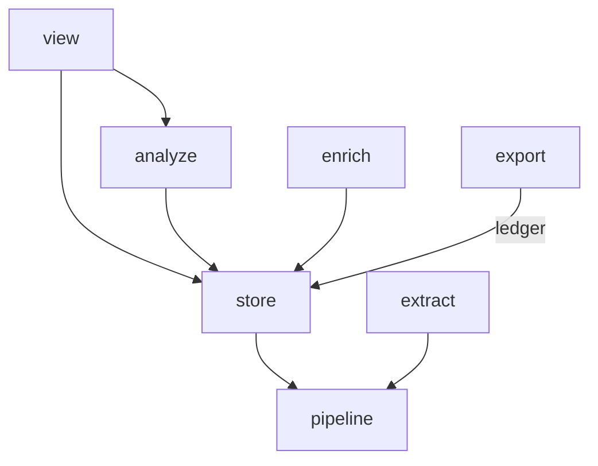

# Phase 2: the `store` package, by moves

Create `src/hyphae/store/` and move all existing storage code into it: the writer and schema from `export/duckdb.py` and `export/schema.py`, the reader from `extract/store.py`, the enrichment tables from `enrich/store.py`, and the delivery ledger from `export/otlp_delivery.py`. Two of the moves cannot be pure, and the layers contract is what says so: the enrichment tables import row types and a reader map that live in `enrich`, so those types move to `models` first and the map becomes a `match`; the ledger imports the exporter's `MAPPER_VERSION`, so the version becomes a method argument. Everything else changes only its import lines. At the end, `extract`, `export`, and `enrich` import no `duckdb`, and `extract` and `export` no longer know each other exist.

Back to [the overview](overview.md). Stacks on [phase 1](phase-1-models.md). Amends the overview's PR table: 2.3 is two PRs, 2.3a and 2.3b.

## Problem

Storage is spread across four packages, each holding whichever piece it needed first. `docs/store.md:35` notes that three modules create tables in the same file: `export/duckdb.py:_SCHEMA`, `export/otlp_delivery.py:_DELIVERY_SCHEMA`, and `enrich/store.py:_SCHEMA`. `extract/store.py` reads the store back as an extractor and imports `export.duckdb.TABLES` to do it, the only reason a parser imports an exporter. `plans/refactor-audit-2026-08-30/findings.md` S23 also flagged `extract/store.py:ROW_ORDER` as a second duplicate registry; that one is already gone — the reader reads `TABLES[table].order` directly today. What's left to fix is `TABLES` itself: anyone changing the schema still has to find four files across three packages.

Two of the pieces point back up at the package they leave. `enrich/store.py` imports `enrich.items` (the row types it selects into), `enrich.stamp.Stamp`, `enrich.validation.Enrichment`, and `enrich.levels.LEVELS` — the last only to read `LEVELS[level].reader`, a method name the store looks up on itself (`store.py:517`). `otlp_delivery.DeliveryLedger` binds `otlp.MAPPER_VERSION` in its two queries. Moved as they are, both would put `store` above `enrich` and `export` on the layers list, which the end graph forbids (verified on a scratch copy: the bare move of `enrich/store.py` is red with exactly `hyphae.store.enrichment -> hyphae.enrich.levels`).

## Call paths, current → proposed

```
current:  cli ─opens─ export.duckdb.open_trace_store ─writes with─ export.duckdb.DuckDbExporter
          export.otlp_delivery.OtlpExporter ─reads─ extract.store.StoreSource ─records in─ export.otlp_delivery.DeliveryLedger (binds otlp.MAPPER_VERSION itself)
          enrich.enricher ─reads and writes─ enrich.store.EnrichmentStore ─selects into─ enrich.items ─dispatches by─ enrich.levels.LEVELS[level].reader

proposed: cli ─opens─ store.trace_store.open_trace_store ─writes with─ store.trace_store.DuckDbExporter
          export.otlp_delivery.OtlpExporter ─reads─ store.trace_reader.StoreSource ─records in─ store.delivery.DeliveryLedger (mapper_version passed per call)
          enrich.enricher ─reads and writes─ store.enrichment.EnrichmentStore ─selects into─ models.items ─dispatches by─ match level
```

## File-tree diff

```
src/hyphae/
  store/
    __init__.py          package docstring for the layout tree
    trace_store.py       ← export/duckdb.py: _SCHEMA, the views, TABLES, PAGE_WAIT, CLI_WAIT, StoreLocked, open_trace_store, DuckDbExporter, refresh_views
    schema.py            ← export/schema.py: SCHEMA_VERSION, MIGRATIONS, check_shape, table_ddl, SchemaVersionError
    trace_reader.py      ← extract/store.py: StoreSource and its three errors
    enrichment.py        ← enrich/store.py: EnrichmentStore, its _SCHEMA, PAYLOAD_COLUMNS, RunLink; `items()` dispatches with a match over Level
    delivery.py          ← export/otlp_delivery.py: DeliveryLedger, _DELIVERY_SCHEMA; fingerprints() and record() take mapper_version
  models/
    items.py             ← enrich/items.py minus Budgets: SEPARATOR, the row and section types, Item, item_key, level_of, TurnItem, AgentRunItem, SessionItem
    enrichment.py        + Stamp and COLUMNS (from enrich/stamp.py), Enrichment (from enrich/validation.py), beside Versions
  export/
    duckdb.py schema.py  deleted
    otlp_delivery.py     ~ keeps Backend, BackendSpec, OtlpCensus, OtlpExporter, the pacer; imports the ledger from store and passes MAPPER_VERSION at its two reads and one write
  extract/store.py       deleted
  enrich/
    store.py items.py    deleted
    prompts.py           + Budgets (from items.py)
    levels.py            ~ LevelSpec loses `reader` and the comment that explained it
    stamp.py             ~ keeps input_hash, mint, stale; imports Stamp and COLUMNS from models
    validation.py        ~ keeps FailureKind, ItemFailure, InvalidOutput, validate; imports Enrichment from models
tests/
  store/
    __init__.py
    test_trace_store.py              ← tests/export/test_duckdb.py
    test_trace_store__locking.py     ← tests/export/test_duckdb__locking.py; its sibling import follows the rename
    test_trace_store__migrations.py  ← tests/export/test_duckdb__migrations.py
    test_schema.py                   ← tests/export/test_schema.py
    test_trace_reader.py             ← tests/extract/test_store.py
    test_enrichment.py               ← tests/enrich/test_store.py
  conftest.py                        ~ imports _SCHEMA and table_ddl from store; + ENRICHMENT_FIXTURES, fixture_db, mutable_db (from tests/enrich/conftest.py)
  enrich/conftest.py                 ~ keeps SPINE and the other constants, stamp(), enrichment(), session_item(), spine_store, store, the autouse guards
  tools/conftest.py                  ~ contract_layers() selects the contract by type
  tools/test_import_contract.py      ~ swapped lifts store above view; + a forbidden-contract case whose .ini carries include_external_packages
  tools/test_gen_imports.py          ~ the graph leaf pins ("extract", "store") at 2.1 and store's only edge at 2.2
  tools/test_gen_layout.py           + every package under hyphae has an Entry
tools/gen_routes.py       ~ imports from store
tools/gen_layout.py       + Entry("src/hyphae/store/", Module("hyphae.store"))
pyproject.toml            ~ layers, edited once per PR that creates or empties a package (Key contracts, Slices); + include_external_packages and the forbidden contract in 2.4
docs/store.md             ~ paths only; the facts hold
docs/otlp-export.md       ~ the ledger's path
docs/enrichment.md        ~ paths only
CONTEXT.md                ~ the Store and Delivery ledger entries point at the package; + Item
```

The stale path strings a grep must catch at each PR, because no gate does: `export/schema.py:3` names `export/duckdb.py` and `enrich/store.py`, `export/schema.py:101` builds a remedy naming `src/hyphae/export/schema.py`, `models/enrichment.py:118` says the DDL lives in `enrich/store.py`, `enrich/items.py:4` names itself, and three files under `analyze/queries/` name `enrich/store.py` in SQL comments. `rg 'export/duckdb|export/schema|extract/store|enrich/store|enrich/items|otlp_delivery\.py' src docs tests CONTEXT.md` at each PR, and the hits are that PR's doc-sync.



Verified: `tools/gen_imports.py` on a scratch copy with every move applied draws exactly these seven edges.

## Key contracts

### The layers list, per PR

`exhaustive = true` on the layers contract means every module under `hyphae` must sit on a line, so the PR that first makes `src/hyphae/store` a real package — 2.1 — adds it in that same PR. Each list below was run through `lint-imports` on a scratch copy with that PR's moves applied, and each is KEPT.

| After | Layers list |
|---|---|
| 2.1 | `cli` / `view \| enrich` / `analyze` / `extract` / `export` / `store` / `pipeline` / `user_settings` / `models \| projects \| pricing \| settings \| store_path` |
| 2.2, 2.3a, 2.3b | `cli` / `view \| enrich` / `analyze` / `export` / `store \| extract` / `pipeline` / `user_settings` / `models \| …` |
| 2.4 | `cli` / `view \| enrich` / `analyze \| export` / `store \| extract` / `pipeline` / `user_settings` / `models \| …` |

The end list, with `enrich` still peered with `view` — carrying forward the guarantee phase 1.2 bought, that nothing under `view` can import `enrich` — and `store` peered with `extract`:

```toml
layers = [
  "cli",
  "view | enrich",
  "analyze | export",
  "store | extract",
  "pipeline",
  "user_settings",
  "models | projects | pricing | settings | store_path",
]
```

Every pair on a peer line has no edge between its members after phase 2: `view` never imports `enrich` (phase 1.2), `analyze` never imports `export` (verified: on `main`, `analyze` imports only `export.duckdb`/`export.schema`, both retargeted to `store` by PR 2.1), and `store` never imports `extract` (the reader rebuilds a trace from rows and never parses). Each pair's members import the same things below them and nothing above, which is what lets them sit on one line. After 2.4, `store` imports `models`, `pipeline`, `projects`, and itself; `enrich` imports `models`, `pricing`, `store`, and itself; `export` imports `models`, `store`, and itself.

### The forbidden contract

Added in 2.4, with `include_external_packages = true` at the `[tool.importlinter]` root (the linter cannot name `duckdb` without it). `allow_indirect_imports = true` is load-bearing: without it the linter follows chains, and `cli -> analyze.runner -> duckdb`, `enrich.enricher -> store.enrichment -> duckdb`, and `export.otlp_delivery -> store.delivery -> duckdb` keep the contract red on every tree the plan ever reaches, including phase 3's. The contract is about who names the driver, not who reaches it.

Until it lands, "`extract` touches no database" has no durable leaf: from 2.2 the graph leaf and the tightened layers case prove `extract` imports nothing from `store`, but a direct `import duckdb` in `extract` would pass every gate through 2.3b. Two PRs of exposure inside one phase is accepted rather than editing the contract twice.

```toml
[tool.importlinter]
include_external_packages = true

[[tool.importlinter.contracts]]
name = "Only the store and, until phase 3, the viewer and analyze speak DuckDB"
type = "forbidden"
source_modules = ["hyphae.extract", "hyphae.export", "hyphae.enrich", "hyphae.cli", "hyphae.pipeline", "hyphae.models"]
forbidden_modules = ["duckdb"]
allow_indirect_imports = true
```

Verified on the scratch copy: with the ledger still in `export`, this contract is red naming only `hyphae.export.otlp_delivery -> duckdb (l.19)`; after the move, `Contracts: 2 kept, 0 broken`. It can go red for a real reason: adding `hyphae.view` to `source_modules` names nine modules — `view.deps`, `view.enrichment`, `view.failures`, `view.store`, and the five under `view/pages/node/` (`rg -l '^import duckdb' src/hyphae/view`) — which is the edit phase 3 will make, and the count phase 3's scope is read against.

`tests/tools/conftest.py:contract_layers()` unpacks `(contract,) = ...contracts` and breaks the moment a second contract exists. It becomes `next(c for c in contracts if c["type"] == "layers")`. `test_the_contract_as_written_is_kept` pins `Contracts: 1 kept, 0 broken` and goes red at 2.4 too; it retargets to `2 kept`. `test_import_contract.py:run_contract` writes its own `.ini` with only a layers contract; the new forbidden-contract case writes `include_external_packages` into that `.ini` as well. Without it the linter does not keep the contract vacuously — it exits 1 with `The top level configuration must have include_external_packages=True when there are external forbidden modules` — so a case asserting only `returncode != 0` would pass on the crash. The case pins the message it expects.

### Interfaces the moves keep

`store.enrichment.EnrichmentStore` exposes what `enrich/store.py` does today, unchanged: `EnrichmentStore(path)` as a context manager; `items(level, project=None)`, `turn_items`, `run_items`, `session_items`, `item_parents(project=None)`, `stamps(level) -> dict[str, Stamp]`, `upsert(item, enrichment, stamp)`, `sweep_zombies() -> int`; the module-level `PAYLOAD_COLUMNS`, `RunLink`, and `_SCHEMA`. Its callers are `enrich/enricher.py` (`items`, `item_parents`, `stamps`, `upsert`, `sweep_zombies`), `cli.py` (constructs it), `tests/conftest.py` (`items`, `upsert`), and the moved test file. The one implementation change: `items()` dispatches with `match level:` over `Level` instead of `getattr(self, LEVELS[level].reader)`, so `LevelSpec.reader` goes away.

`store.delivery.DeliveryLedger(connection, *, backend)` keeps its constructor. `fingerprints(*, mapper_version: str)` and `record(session_id, fingerprint, spans_sent, *, mapper_version: str)` take the version they bind, with no default: the ledger has no version of its own, and a default would let a ledger and an exporter disagree silently. `OtlpExporter` and `OtlpCensus` pass `MAPPER_VERSION` at their two reads and one write; `MAPPER_VERSION` stays in `export/otlp.py`, where it is also a span attribute.

`models/items.py` carries the row and item types verbatim; `models` still imports only `models`. `Budgets` goes to `enrich/prompts.py`, whose functions already take one, and `levels.py` already imports `prompts`. No test imports `Budgets` by name.

## Chosen test seam

Moves, so the suite stays green with updated import lines; the two rewrites each have one leaf that goes red first.

`tests/store/` mirrors the package's module names, per `.claude/rules/testing.md`: `test_<module>[__<topic>].py`, so `tests/export/test_duckdb__locking.py` becomes `tests/store/test_trace_store__locking.py`, and so on down the file-tree diff. The ledger's leaves stay in `tests/export/test_otlp__delivery.py`: they drive the ledger through `OtlpExporter` and lean on `tests/export/conftest.py`'s fixtures, and one file moving without its fixtures is a fixture move too.

Fixtures move only where the fixture rule forces it. `tests/enrich/test_store.py` uses `fixture_db` and `mutable_db` from `tests/enrich/conftest.py`; once it sits under `tests/store/`, pytest no longer resolves them. Importing a fixture from another conftest reads as an unused import and ruff deletes it, and a copy in a new `tests/store/conftest.py` would build the session fixture twice. So `ENRICHMENT_FIXTURES`, `fixture_db`, and `mutable_db` move to the root `tests/conftest.py`, beside `corpus_db` and `enriched_db`, which already live there for the same reason. The other three files that use them (`test_client__pool.py`, `test_prompts.py`, `test_prompts__budget.py`) resolve them from the root without an edit. `spine_store`, `store`, the constants, and the helpers (`stamp()`, `enrichment()`, `session_item()`) stay in `tests/enrich/conftest.py`; the moved file keeps importing the helpers and constants from `tests.enrich.conftest`, which is a plain module import. It loses the `refuse_subprocess` autouse, which it never exercised. Phase 2 adds no `tests/store/conftest.py`.

The scaffolding leaves:

- `tests/tools/test_import_contract.py:swapped` swaps `extract` and `export`, which 2.1 makes legal (neither imports the other once `duckdb.py` moves). It becomes: lift `store` to the line above `view | enrich`. Verified red from 2.1 through 2.4: `hyphae.view is not allowed to import hyphae.store` (with `analyze`, `enrich`, and `export` beside it), and `view --> store` holds through phase 5.
- `tests/tools/test_gen_imports.py::test_the_layers_the_plan_drew_are_the_ones_the_graph_shows` pins `("extract", "export")`, gone at 2.1. At 2.1 it pins `("extract", "store")` drawn and no drawn edge ending in `export` or `extract`; at 2.2 it tightens to: the edges out of `store` are exactly `{("store", "pipeline")}` and none ends in `extract`.
- `tests/tools/test_gen_layout.py` gains a leaf: every `pkgutil.iter_modules(hyphae.__path__)` entry with `ispkg` has an `Entry` under `src/hyphae/`. `ENTRIES` is hand-kept, and today nothing notices a package missing from the Layout tree.
- `tests/store/test_schema.py`'s DDL digests re-point their owners to the store modules; the DDL moves byte-for-byte, so no digest changes.

## Slices

Each PR edits the layers list to the row in the table above, and greps for the stale paths listed under the file-tree diff.

1. **PR 2.1: the writer and schema.** `git mv export/duckdb.py src/hyphae/store/trace_store.py` and `git mv export/schema.py src/hyphae/store/schema.py`. Rewrite imports in `cli`, `view/store.py`, `view/app.py`, `enrich/store.py`, `analyze/runner.py`, `extract/store.py`, `export/otlp_delivery.py` (`check_shape` from `export.schema`), `tools/gen_routes.py`, and every test that imports `export.duckdb`/`export.schema` — found by grep at implementation time, not enumerated here (`tests/conftest.py` is one; there are more). Add `store` to the layers list as its own line between `"export"` and `"pipeline"`: at this point `store` imports only `models`, while `extract`, `export`, `enrich`, and `analyze` each still import it directly for what this PR just moved. Add the `gen_layout` Entry and its leaf; rewrite `swapped` and the graph leaf; move the four test files into `tests/store/` with the `test_trace_store*` and `test_schema` names. Verify: `rg 'export\.duckdb|export\.schema' .` is empty; `mise run check`.
2. **PR 2.2: the reader.** `git mv src/hyphae/extract/store.py src/hyphae/store/trace_reader.py`. `extract` now imports only `models`, `pipeline`, `pricing`, and `projects` — it no longer imports `store` at all, since the one file that did just moved into it. `store` gains `pipeline` (for `SessionSource`), so it must sit above `pipeline`; since neither `store` nor `extract` imports the other now, merge them onto one line, replacing the two separate lines PR 2.1 left: `"store | extract"`, directly above `"pipeline"`. That peer line is what forbids `extract --> store`; the graph leaf tightens to say the same. Rewrite the test files that import `StoreSource` from `hyphae.extract.store` — found by grep (`tests/export/conftest.py` is one). `tests/extract/test_store.py` becomes `tests/store/test_trace_reader.py`. Verify: `rg 'hyphae.export|hyphae.store' src/hyphae/extract` is empty; `mise run check`, `lint-imports` included.
3. **PR 2.3a: the row types to models.** `git mv src/hyphae/enrich/items.py src/hyphae/models/items.py`, then cut `Budgets` out to `enrich/prompts.py`. Cut `Stamp` and `COLUMNS` out of `enrich/stamp.py` and `Enrichment` out of `enrich/validation.py` into `models/enrichment.py`, beside `Versions`; `input_hash`, `mint`, `stale`, `validate`, and the failure types stay. Rewrite importers by grep (`enrich.items` has four test importers on `main`, `stamp` seven, `validation` eight). Coin **Item** in `CONTEXT.md`'s Enrichment section: one thing that gets one enrichment row — a turn, an agent run, or a session — and the row type the store selects it into. No layers edit: `models` still imports only `models`. Independent of 2.1 and 2.2, but stacks on 1.2, which touched the same files. Verify: `rg 'hyphae\.enrich' src/hyphae/models` is empty; `mise run check`; `git log --follow` is blind to `Stamp` and `Enrichment` (classes cut out of a file), so verify their history by `git log -S<symbol>` and say so in the PR body — `items.py` is a whole-file `git mv` and `--follow` reaches it.
4. **PR 2.3b: the enrichment tables to store.** `git mv src/hyphae/enrich/store.py src/hyphae/store/enrichment.py`. Delete `LevelSpec.reader` and its comment from `enrich/levels.py`; `items()` becomes a `match level:` over `Level` calling `turn_items`, `run_items`, `session_items`. `enrich` keeps importing `store` — `enricher.py` imports `EnrichmentStore` from the new path — so it stays on the `view | enrich` line; no layers edit. Rewrite the test files that import `EnrichmentStore` from `hyphae.enrich.store` — by grep, not enumerated (more than a dozen on `main`, `tests/conftest.py` among them). Move `tests/enrich/test_store.py` to `tests/store/test_enrichment.py` and the three fixtures to the root conftest. Verify: `rg -i 'create table|select ' src/hyphae/enrich` is empty (`enrich` never imported `duckdb` directly, so that grep proves nothing; the SQL leaving is the fact); `rg 'hyphae\.enrich' src/hyphae/store` is empty; `mise run check`.
5. **PR 2.4: the ledger.** Move `DeliveryLedger` and `_DELIVERY_SCHEMA` out of `otlp_delivery.py` into `store/delivery.py`; give `fingerprints` and `record` their `mapper_version` keyword; `OtlpExporter` and `OtlpCensus` pass `MAPPER_VERSION` at the two reads and one write. The twelve construction sites (`cli.py`, `tests/export/conftest.py`, and the `test_otlp__*` files) stay as they are; the one test that calls `fingerprints()` directly (`test_otlp__delivery.py:362`) gains the keyword. `export` keeps importing `store` for the `DeliveryLedger` type, so finish the layers list by merging `analyze` and `export` onto one peer line — neither has ever imported the other. Add `include_external_packages`, the forbidden contract, the `contract_layers()` fix, and the forbidden-contract test case. Verify: `rg 'import duckdb' src/hyphae/export` is empty; `mise run lint-imports` prints `Contracts: 2 kept, 0 broken`; `git log --follow` is blind to the ledger (eighty lines cut out of `otlp_delivery.py`), so verify its history by `git log -SDeliveryLedger` and say so in the PR body.

## Decisions

- **`enrich` stays beside `view` on the layers list, not folded into `analyze | export`.** Phase 1.2 put `view` and `enrich` on one peer line specifically to close off `view --> enrich`, and its own Open questions flagged that phase 2's first draft reopened the edge by listing `view` alone above `analyze | enrich | export`. Nothing in phase 2 changes whether `view` and `enrich` import each other, so the line carries forward unchanged. Closes `phase-1-models.md`'s open question "Phase 2's layers list."
- **`trace_store.py`, not `duckdb.py`.** `hyphae.store.duckdb` shadows the driver name inside the only package that imports it; audit item C23 already requested the rename. Other renames (such as stripping the driver name from `DuckDbExporter`) wait for phase 5 so move PRs stay moves.
- **One package, several modules, one per table family.** Putting all DDL into a single `store/duckdb.py` would yield a 1,500-line file. `schema.py` still stamps the schema version on the file, and each owner still calls `check_shape` with its own DDL, as described in `docs/store.md:81`.
- **The reader lives in `store`, not `export`.** It reads rows out of the store; `OtlpExporter` is its caller, not its owner.
- **`enrich/store.py` moves whole, after its types move to `models`, rather than splitting or waiting.** The module's interface is deep: seven methods over 700 lines of selection and upsert SQL, and every caller asks for finished items. Splitting it into a raw-row store under `store` and item shaping under `enrich` (a) would rewrite most of it, leave `enrich` holding half the SQL the overview says only `store` speaks, and hand phase 4.5 a second reshaping. Deferring it (c) breaks phase 3, which reads "already in `store/enrichment.py` since phase 2.3" and widens the forbidden contract on that assumption, and turns 4.5's rename into a move plus rewrite. Moving the types first (b) is what phase 1's rule already says — "a type moves to `models` when a second package needs it" — and `store` is the second package. The types are the row shapes the tables select into; the SQL stays where it is.
- **`Stamp` and `Enrichment` go to `models/enrichment.py`, not `store`.** Both are read by `view` (`Enrichment.stale` via `Versions.current()`), `enrich`, and now `store`; `models` is the one package all three sit above. `input_hash`, `mint`, and `validate` stay in `enrich` because only the pass calls them.
- **`match level` over `Level`, not a `_READERS` dict in `store`.** A dict literal keyed by `Level` is closed only by a test; pyrefly closes a `match` over the StrEnum (verified: dropping one arm reports `Missing cases: Level.session`). The `reader` field existed to let the store look itself up through `enrich`; once the store owns the dispatch, the field is a name with no reader.
- **`mapper_version` is a method keyword, not a constructor argument or a constant in `models`.** A constructor argument would touch twelve construction sites and make `cli.py` thread the exporter's constant into the exporter's own dependency; and a ledger built with one version and an exporter sending another would have no check, unlike the `backend` mismatch, which `BackendMismatchError` catches. Moving `MAPPER_VERSION` to `models` would move an exporter fact (it is also a span attribute, `otlp.py:173`) for the ledger's convenience. Passing it where it is bound touches two reads, one write, and one test line.
- **`allow_indirect_imports = true` on the forbidden contract.** The contract says who names the driver. Chain-following would make it a statement that nothing may reach `store`, which is false by design.
- **Test files take the module's name, not the old file's.** `test_duckdb.py` under `tests/store/` would name a module that no longer exists; the testing rule mirrors package layout.
- **`fixture_db` and `mutable_db` go to the root conftest, not a `tests/store/conftest.py`.** One copy, resolved by name from either directory; the root already hosts the session-scoped store fixtures.
- **2.3 is two PRs.** 2.3a is a `models` move that stacks on 1.2 and could land before 2.1; 2.3b is the `store` move that needs both. One PR would be a move that also edits three `enrich` modules and coins a term, which is two review units.

## Out of scope

- SQL in `view` or `analyze` (deferred to phase 3).
- Renaming classes (phase 5).
- Moving the exporter's ledger leaves into `tests/store/`: they need `tests/export/conftest.py`'s fixtures. `tests/store/test_delivery.py` drives the ledger on its own, under a mapper version the exporter never passes.
- Any write path except enrichment (phase 4).

## Open questions

- `tests/conftest.py` imports the private `_SCHEMA`. It should keep doing so from the new path; whether to make `_SCHEMA` public is a question for phase 5.
- `view/enrichment.py` defines its own `Enrichment` NamedTuple. Nothing in phase 2 imports both, but phase 4.5 moves the viewer's enrichment reads onto the repository, and one of the two names yields then.
- `models/items.py` as the name: `items` is what `enrich` calls them and what `CONTEXT.md` will define. `models/enrichment_items.py` is the alternative if a second kind of item ever appears.
- The `tests/store/test_enrichment.py` file imports helpers from `tests.enrich.conftest`. That import is legal and works, but a helper module that is not a conftest (`tests/enrich/items.py` is the precedent) would read cleaner; whether to split the helpers out is a phase 5 tidy.
