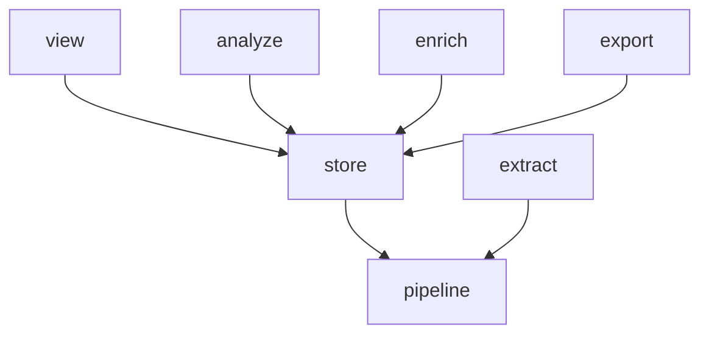

# Phase 3: the SQL library and the connection move into the store

Move the versioned SQL library out of `analyze/` and the viewer's fetch helpers out of `view/store.py` into `store/`, then replace the connection the viewer threads through its read signatures with a `Store` handle. At the end, only `store` imports `duckdb`, the viewer no longer imports `analyze`, and the import graph has the shape it keeps.

Back to [the overview](overview.md). Stacks on [phase 2](phase-2-store-package.md).

## Problem

The SQL has two homes. Seventy statements live in `analyze/queries/` (41 of them `view_*.sql`), loaded and cited by `analyze/queries.py`; the macros both consumers install live in `analyze/macros.py`. The viewer reaches into `analyze` for them from fourteen files. The SQL that pages compose around those statements lives in `view/store.py`: `fetch`, `page_rows`, `window`, `cursorless_rows`, `bound`, `sorted_sessions`, and the `SORTS`, `FILTERS`, and `SHOWN` tables. Every viewer module that reads passes a `duckdb.DuckDBPyConnection`, making the driver the currency of a package that should not know it.

`view/store.py` is not one thing, and the phase-2 lesson applies: a file that reads upward is not a pure move. Two of its functions read the viewer and the analysis layer. `bound()` types its widths as `bounds.Widths` and asks `manifest.describe(page).params` which parameters a statement declares; `sorted_sessions` reads `bounds.LIST_WIDTHS` to size the session list. Moved as they stand, `store.pages` imports `view.bounds` and `analyze.manifest`, and the layers contract goes red on both (verified on a scratch copy: `lint-imports --no-cache` names both edges). So the move is cut first, then moved, as phase 2 did for `enrich/store.py`.

## Call paths, current → proposed

```
current:  page.read ─calls─ view.store.fetch(connection, Page.X, bindings) ─loads─ analyze.queries.statement ─over─ analyze.macros
          hp query ─calls─ analyze.runner.run ─opens─ store.trace_store.open_trace_store ─loads─ analyze.queries.statement
          view.deps.request_store ─yields─ duckdb.DuckDBPyConnection

proposed: page.read ─calls─ store.pages.fetch(store, Page.X, bindings) ─loads─ store.library.statement ─over─ store.macros
          hp query ─calls─ analyze.runner.run ─opens─ store.handle.open_store ─runs─ Store.rows(sql, bindings)
          view.deps.request_store ─yields─ store.handle.Store
```

Phase 4 replaces `fetch(store, Page.X, …)` with typed repository methods page by page; phase 3 only moves the mechanism.

## File-tree diff

```
src/hyphae/
  store/
    queries/             ← analyze/queries/*.sql, all 70, by git mv; three path comments naming analyze/macros.py rewrite in their own commit
    library.py           ← analyze/queries.py whole: Scope, QueryError, ParamType, Param, Query, PARAM_TYPES, the width constants, VIEW_PREFIX, load, statement, parameters, relations, citation, shown
                         + names(): the sorted stems of the query directory, moved from analyze/manifest.py
    macros.py            ← analyze/macros.py
    pages.py             ← view/store.py after the cuts: Page, Fragment, Value, Library, TURN_CURSOR, Row, fetch, page_rows, Paged, Listed, MATCHED_ROWS, window, cursorless_rows, SORTS (keys only), Filter, FILTERS, DIRECTIONS, SHOWN, PAGER_PROBE, Listing, sorted_sessions, listed, dropped, paged
    handle.py            + Store, Fetched, open_store
  analyze/
    queries/ queries.py macros.py   deleted
    manifest.py          ~ imports from store.library; names() leaves for the library
    runner.py            ~ opens through store.handle.open_store and runs its SQL through Store.rows
  view/
    store.py             deleted
    bounds.py            + bound, NO_SIZES (from view/store.py)
    deps.py              ~ request_store yields a Store
    app.py               ~ opens through store.handle; handles SchemaVersionError where it handled SchemaMoved
    pages/sessions/models.py   + HEADINGS: the labels SORTS carried
    pages/sessions/read.py     + _list_bound (from view/store.py); passes the session list's bindings into sorted_sessions
    pages/sessions/routes.py   ~ headings from HEADINGS
    pages/query/read.py        ~ library.names()
    pages/**/*.py enrichment.py nodes.py   ~ DuckDBPyConnection annotations become Store
tests/store/test_macros.py     ← tests/analyze/test_macros.py
tests/store/test_library.py    + names(), and the citation leaf from tests/analyze/test_queries.py
tests/store/test_handle.py     + Store.rows and open_store
tests/analyze/test_queries.py  ~ stays; imports retarget
tests/view/test_bounds__binding.py  ← tests/view/test_store.py (every leaf there drives bound)
tests/view/test_layout.py      ~ the library, the pages module and bound each read from their new home
tests/view/test_lifecycle.py   ~ counts store.handle's door; expects SchemaVersionError
tests/view/test_bounds__lists.py tests/view/pages/node/test_walk.py tests/gallery/serve.py   ~ wrap or annotate a Store
tests/tools/test_import_contract.py   ~ the forbidden contract's roll-call and red-run leaves
pyproject.toml           ~ the forbidden contract names every package but store
docs/store.md docs/viewer.md docs/analysis.md docs/layering.md   ~ paths
CONTEXT.md               ~ Library points at store/queries/; Forbidden contract drops its "until"; new term Store handle
```



The edge set is what `tools/gen_imports.py` draws (it omits `cli`, `models` and the leaf modules). It reaches this shape at PR 3.2b and PR 3.3 leaves it there; the per-PR table under Key contracts says which PR drops which edge.

## Key contracts

```python
class Fetched(NamedTuple):
    """What one statement answered: the column names DuckDB reported, and the rows as tuples."""
    columns: tuple[str, ...]
    rows: list[tuple[Any, ...]]

class Store:
    """One open trace store, for as long as the caller holds it.

    A page gets one per request (`PAGE_WAIT`); a pass or a query gets one per run
    (`CLI_WAIT`). Phase 4 hangs one repository per area off it.
    """
    def __init__(self, connection: duckdb.DuckDBPyConnection) -> None: ...
    def rows(self, sql: str, bindings: Mapping[str, ParamValue]) -> Fetched: ...

@contextmanager
def open_store(path: Path, *, read_only: bool, wait: float) -> Generator[Store]:
    """`open_trace_store` with the macros installed, handing back a Store. Raises what it raises."""
```

`rows` is the one verb. `store.pages.fetch` derives its dict rows from `Fetched`; the runner reads `columns` for its header and `rows` for its body, and runs `_PROJECT_SESSIONS` and `_SESSION_PERIODS` through the same verb. Nothing outside `hyphae.store` touches `store.connection` or imports `duckdb`. The linter enforces the second half; the first is a convention until phase 4 makes the attribute private.

The forbidden contract keeps every source it has today and gains the two the name has been excusing. `allow_indirect_imports` stays: without it, a source that imports `hyphae.store` is guilty of the store's own `duckdb` import (`phase-2-store-package.md`, Key contracts).

```toml
[[tool.importlinter.contracts]]
name = "Only the store speaks DuckDB"
type = "forbidden"
source_modules = [
    "hyphae.cli",
    "hyphae.view",
    "hyphae.enrich",
    "hyphae.analyze",
    "hyphae.export",
    "hyphae.extract",
    "hyphae.pipeline",
    "hyphae.user_settings",
    "hyphae.models",
    "hyphae.projects",
    "hyphae.pricing",
    "hyphae.settings",
    "hyphae.store_path",
]
forbidden_modules = ["duckdb"]
allow_indirect_imports = true
```

`tests/tools/test_import_contract.py` pins the roll-call: today it reads `sources == layers - {"store", "view", "analyze"}`, and after PR 3.3 it reads `sources == layers - {"store"}`. The layers line does not change in this phase, because no package is added or removed:

| PR | Layers line | Edges `gen_imports` draws | Forbidden sources |
| --- | --- | --- | --- |
| 3.1 | `cli / view \| enrich / analyze \| export / store \| extract / pipeline / user_settings / models \| projects \| pricing \| settings \| store_path` | today's seven: the six above plus `view --> analyze` | today's eleven |
| 3.2a | same | the six above; `view --> analyze` is gone | same |
| 3.2b | same | same six | same |
| 3.3 | same | same six | thirteen: plus `hyphae.view`, `hyphae.analyze` |

3.1, 3.2b and 3.3 were run on a scratch copy (`lint-imports --no-cache`: `2 kept, 0 broken`; `gen_imports` printed the sets above). 3.2a's row is inferred from 3.2b's run: the only `view → analyze` import left after the cuts is `pages/query/read.py`'s `manifest.names()`, which 3.2a retargets, and 3.2b's `git mv` touches no other import out of `view`.

### Interfaces the moves keep

Everything a page imports from `view/store.py` today is importable from `store.pages` after 3.2b under the same name, except the four this table lists:

| Today (`view/store.py`) | After phase 3 | Why it moved |
| --- | --- | --- |
| `bound`, `NO_SIZES` | `view/bounds.py` | Types its widths as `Widths`: it is the surfaces' own binder |
| `list_bound` | `pages/sessions/read.py:_list_bound` | Reads `LIST_WIDTHS`; one caller |
| `SORTS` (column → heading) | `store.pages.SORTS` (columns) and `pages/sessions/models.py:HEADINGS` (labels) | Display vocabulary stays out of the store |
| `SchemaMoved`, `open_store` | `store.schema.SchemaVersionError`, `store.handle.open_store` | See PR 3.3 |

`sorted_sessions` keeps its name and its `Listing` but no longer sizes the list itself: it takes `size` and the bindings the read composed (`(store, sort, direction, size, filters, bindings, *, described)`), and the read cites the same two mappings it always did, so the citation bytes are unchanged. The Query page's contract holds: `store.library.citation(name, bindings)` is the same function at a new path, and every footer still cites a statement `hp query` can run.

`SchemaMoved` is deleted rather than moved. It was a rename of `SchemaVersionError` for the viewer's handler, and `SchemaVersionError` is raised at one door only (`store/schema.py`, from `open_trace_store`), so `@app.exception_handler(SchemaVersionError)` catches the same requests the `SchemaMoved` handler did and `build_app` refuses the same stores. `tests/view/test_lifecycle.py` asserts on the store's exception directly. Alternative rejected: keep `SchemaMoved` in `store.handle` as the wrapper it is today; it would be the store renaming its own exception for one caller.

`open_trace_store` stays the one counted door. `test_lifecycle` monkeypatches it on the module `open_store` lives in, which becomes `hyphae.store.handle`.

## Chosen test seam

No rendered bytes change but three comments. The oracle is the existing viewer tier: `tests/view/test_bounds__*.py` pin page bytes at every knob, and the render of every scenario in `tests/view/scenarios.py` before and after each PR is the diff a reviewer reads. One scenario alone cannot see the library: only `/query/view_sessions` is a scenario, and every one of the 70 statements serves at `/query/<name>`, so the one-off render covers the scenarios plus every query page, and PR 3.1 adds the durable form — `tests/view/pages/query/test_query.py::test_every_statement_in_the_library_serves_as_a_query_page`, parametrized over `library.names()`, asserting `plain(block(page, "sql"))` equals the `.sql` file read off disk — not `library.load(name)`, which a loader mutant would bend on both sides of the assertion. The statements move byte for byte (`git mv` of the `.sql` files); the only text that changes under a Query page is the three `.sql` comments that name `analyze/macros.py` (`rg 'analyze/' src/hyphae/analyze/queries` lists them), rewritten in their own commit in PR 3.1 so the render diff of those three pages is exactly that comment.

`tests/analyze/test_queries.py` stays where it is, and no fixture moves out of `tests/analyze/conftest.py`. Every leaf in that file reads the shipped queries through something `analyze` still owns: `manifest.describe` for a statement's scope and defaults, or `hp query` through the `run_query`/`enriched_query` fixtures, with the `far_future` autouse clock pin under both. Moving it to `tests/store/` would hoist those three fixtures to the root conftest, and `far_future` is autouse: at the root it would pin the clock for every test in the suite. Several leaves there call `library.statement`, `relations`, `parameters` and `PARAM_TYPES` directly (`identifiers()`, `reads_enrichment()`, `CUT_SQL`, the defaults leaf, the corpus-views leaf) and keep doing so; the citation leaf is the only one that *moves*, to `tests/store/test_library.py` beside a leaf for `names()` and a pin of the size constants the manifest and viewer bind (`RAW_CHARS`, `ERROR_CHARS`, `SIGNATURE_CHARS`, `COMMAND_HEAD_CHARS`, `LOG_CHARS`, `WINDOW_DAYS`) against their documented values. `tests/analyze/test_query.py` (the CLI) stays untouched but for imports.

`tests/analyze/test_macros.py` moves whole to `tests/store/test_macros.py`; it takes no analyze fixture. Its `tagged_store` docstring explains itself by the analyze tier's clock patch, which no longer runs over it; rewrite the docstring in the move commit.

`tests/store/test_handle.py` is new and small: `rows()` reports the columns DuckDB named and the rows as tuples; `open_store` hands back a store with the macros installed (a statement calling `cut` runs). Locking is not its business: `tests/store/test_trace_store__locking.py` already covers both waits, `StoreLocked`, and a refused store freeing its lock.

The viewer's test fixtures stay raw connections. `tests/view/conftest.py:reading` yields a `duckdb` connection with the macros installed, and dozens of leaves run `connection.execute(...)` against it to state their expectations. Wrapping the fixture in a `Store` broke every one of them on the scratch copy (`Store has no attribute execute`). The two page-helper calls that need a `Store` (`tests/view/test_bounds__lists.py`'s `cursorless_rows` sites) wrap `Store(store)` in place; `tests/view/pages/node/test_walk.py`'s `watched` fake annotates `connection: Store`; `tests/gallery/serve.py:corpus_now` reads through `rows`.

`tests/view/test_layout.py` pins more than the linter does, and each PR retargets it once:

- 3.1: `QUERIES` becomes `"hyphae.store.library"` and `queried()` scans `library.` attributes instead of `queries.`
- 3.2a: `LAYERED["store"]` drops from `BASE` to `LEAF` (the module no longer imports `bounds`), and the vocabulary leaf's last assertion splits: `page_rows` is still taken from the store, `bound` from `bounds`
- 3.2b: `"store"` leaves `LAYERED`; `taken()` learns a dotted module name so the vocabulary leaf reads `taken(path, "hyphae.store.pages")`; the "imports the store whole" arm becomes an AST check for `from hyphae.store import pages` or `import hyphae.store.pages` in a routes module, because `imports()` sees only `hyphae.view.*` and would otherwise pass vacuously. Verified: the rewritten leaf is green on the scratch copy and goes red when a routes module is given `from hyphae.store import pages`

`tests/tools/test_import_contract.py` retargets twice. At 3.2b the viewer red-run leaf must break on `hyphae.view.deps -> duckdb` rather than `hyphae.view.store -> duckdb`, because that file is gone. At 3.3 the viewer is a source, so the same leaf lifts `hyphae.store` into the sources instead and expects `hyphae.store is not allowed to import duckdb:` naming `hyphae.store.trace_store -> duckdb`; the roll-call leaf asserts `sources == layers - {"store"}`.

## Slices

1. **PR 3.1: the library and macros.** `git mv` the SQL directory, `analyze/queries.py` to `store/library.py`, and `analyze/macros.py` to `store/macros.py`; `analyze` and `view` import `from hyphae.store import library` and `from hyphae.store import macros`, and every `queries.X` site becomes `library.X`. The rename grep is `rg '\bqueries\b' src tests tools`, **not** `\bqueries\.`: seven sites use the module as a bare name and the dotted form misses them — `monkeypatch.setattr(queries, "QUERY_DIR", …)` (five in `tests/analyze/test_query.py`, one in `tests/view/test_store.py`), `getattr(queries, name)` and the string `node.value.id == "queries"` in `tests/view/test_layout.py`; six of the seven fail at runtime with `NameError` and the seventh scans nothing and stays green. One trap: `tests/analyze/test_query.py::test_a_name_outside_the_query_directory_is_refused_like_an_unknown_one` has a local `library = tmp_path / "library"` that shadows the module once `queries` becomes `library`; rename the local. `library.names()` lands here too, with `manifest.names()` a one-line delegate until 3.2a, so `tests/store/test_library.py` can pin the registry beside the citation leaf and the size constants. Rewrite the three `.sql` comments and the five Python comments naming `analyze/macros.py` (`view/pages/query/markup.py`, `view/nodes.py`, `view/text/tool_names.py` ×3) in their own commit. Retarget `test_layout.QUERIES` and `queried()`; add the every-statement query-page leaf (Chosen test seam). Verify: `rg 'analyze[./](queries|macros)' src tests tools docs CONTEXT.md .claude` is empty — the slash form included, because `manifest.py`'s error text, `cli.py`'s `--help`, `view/static/tokens.css`, `docs/store.md`, `docs/viewer-titles.md`, `.claude/rules/viewer-ui.md` (its `paths:` glob among them) and the **Library** entry of `CONTEXT.md` name the old paths that way; `mise run check`.
2. **PR 3.2a: the cuts.** No file moves. `manifest.names` goes (the library has owned `names()` since 3.1); `bound` and `NO_SIZES` move to `view/bounds.py`, where `bound` asks `library.parameters(library.statement(page))` which names a statement declares (importing the library as a module, so `tools/gen_bounds.py:declared()` does not pick the library's width constants up as the viewer's); `list_bound` becomes `pages/sessions/read.py:_list_bound`; `sorted_sessions` takes `size` and `bindings`; `SORTS` becomes a tuple of columns in today's order (the 400 message and the heading order both print it) and `pages/sessions/models.py:HEADINGS` carries the labels; `pages/query/read.py` calls `library.names()`. Retarget `test_layout` as above; `git mv tests/view/test_store.py tests/view/test_bounds__binding.py`. The red leaf for this PR's headline is the graph leaf, not the linter, which cannot express it because `analyze` sits below `view`: add `assert ("view", "analyze") not in drawn` to `tests/tools/test_gen_imports.py::test_the_layers_the_plan_drew_are_the_ones_the_graph_shows` first. Verify: `rg 'hyphae.analyze' src/hyphae/view` is empty; `rg 'bounds\.|manifest' src/hyphae/view/store.py` is empty; the render diff of every scenario is empty; `mise run check`.
3. **PR 3.2b: the fetch helpers.** `git mv src/hyphae/view/store.py src/hyphae/store/pages.py`; rewrite `hyphae.view.store` to `hyphae.store.pages` everywhere (`rg 'hyphae\.view\.store|hyphae.view import store' src tests tools`). Retarget `test_layout` and the viewer red-run leaf as above. Verify: `mise run check`; `python -m tools.gen_imports` draws the six edges.
4. **PR 3.3: the handle.** Add `store/handle.py`; `store.pages` loses `open_store`, `SchemaMoved` and its `duckdb`, `macros` and `ExitStack` imports, and `fetch` reads through `store.rows`; every `DuckDBPyConnection` annotation in `view/` and `analyze/runner.py` becomes `Store`, and every viewer open site (ten: `app.py`, `deps.py`, `node/browser.py` ×3, and the reads of `offload`, `sessions`, `errors`, `records`, `projects`) calls `open_store(db, read_only=True, wait=PAGE_WAIT)`; `view/enrichment.py:enriched` and the runner read through `rows`; `app.py` handles `SchemaVersionError`; widen the forbidden contract and rename it; retarget `test_lifecycle` and the two contract leaves; add `tests/store/test_handle.py`. Two things are green by construction unless pinned, so pin them: `test_lifecycle`'s per-request case asserts `"Restart the viewer." in message`, and `test_handle` has a case that `open_store(path, read_only=False, wait=0)` can create a temp table while `read_only=True` cannot write a base table. Beyond the test sites listed under Chosen test seam, three more take the new signature or a `Store`: `tests/view/pages/node/test_nav_tree__names.py`'s `open_store(collided)`, `tests/gallery/serve.py`'s second `open_store` site, and `tests/view/pages/projects/test_projects.py`'s own `window(store: duckdb…)` helper. `plans/test-runtime/design.md` names `SchemaMoved` and is sequenced after this phase; rewrite it to `SchemaVersionError` here. Verify: `rg 'duckdb' src/hyphae/view src/hyphae/analyze` is empty; `rg 'SchemaMoved' src tests docs plans` is empty; `mise run check`; `mise run e2e` once, because this PR touches every page's read path.

Scratch runs of 3.2b and 3.3 (`pyrefly check src tests`: 0 diagnostics, matching `main`; the view, analyze, store, tools and gallery tiers green but for the leaves this document says retarget and the leaves that read the git checkout) are the evidence for the per-PR table.

## Decisions

- **All SQL moves, including the corpus statements `hp query` runs.** One home for SQL was the decision on 2026-09-16. `analyze` keeps what is not SQL: the manifest's production defaults, the runner's project relations, and the report templates. Alternative rejected: leave the corpus statements in `analyze` and move only `view_*`, which makes the library's location depend on who asked first.
- **PR 3.2 is cut, then moved (3.2a, 3.2b), and the cuts stay in the viewer.** `bound` is the surfaces' binder: it exists to check that a read named every parameter a statement declares and nothing a width or key shadows, and its type is `Widths`. It lives in `view/bounds.py` beside the widths it types. Alternatives rejected: (a) an enabling PR moving `Widths` and `manifest.describe` down into the store, which makes the store the owner of the viewer's surface vocabulary and drags the manifest's production defaults out of `analyze`; (b) `bound(page, declared, widths, …)` taking the declared parameters as an argument, which makes some thirty read sites each re-derive what `bound` derives once.
- **`bound` reads the library, not the manifest.** `manifest.describe(page).params` and `library.parameters(library.statement(page))` name the same set for every `view_` statement: no `view_` query has a `DEFAULTS` entry (`tests/analyze/test_queries.py:VIEW_SIZES` says so). That is true but not the whole equivalence: the two timelines (`session_timeline`, `run_timeline`) are bound pages with a manifest default (`log_chars: 300`), and the identity holds only because `bound` never read `.default` — it fills `log_chars` from `LOG_WIDTHS`, which equals `LOG_CHARS`. `describe`'s other checks — the type of every parameter, no orphan default — are held by the library tier's leaves, not by the read that binds. The output is identical; what changes is that a widths mismatch is refused by `bound`'s own check instead of the manifest's. `tests/view/pages/query/test_query.py::test_a_citation_quotes_every_binding_its_query_takes` keeps reading `manifest.catalog()`, as the second source that the new `bound` and the old manifest still agree.
- **`store/pages.py` keeps the viewer's enums for now.** Phase 4 deletes `Page`, `Fragment`, and `Value` one method at a time; carrying them through phase 3 keeps PR 3.2b a `git mv`.
- **A `Store` class with one verb, `rows`.** The viewer needs a thing to hang repositories off; a protocol would only hide the driver's name. `rows` returns columns and tuples because the two consumers disagree on row shape (`fetch` wants dicts, the runner wants a header and a body), and a cursor is the driver's type.
- **The viewer opens with `open_store(db, read_only=True, wait=PAGE_WAIT)` at each of its ten sites.** Alternative rejected: a viewer-side `open_store(db)` wrapper keeping the two arguments in one place — it would be a pass-through, and phase 4 replaces the sites with repository calls anyway.
- **`SORTS` splits.** The store keeps the columns a sort key names; the heading a column prints under ("Started", "Session") moves to `pages/sessions/models.py:HEADINGS`. Keeps display vocabulary out of the store.
- **`SHOWN` stays in the store and keeps taking the widths as bindings.** It reads as presentation, but the cut is the `cut` macro the store owns; the surface declares the widths (`view/bounds.py`), the read binds them, the footer quotes them. That is already how it works, and the layering shows it: `SHOWN` reads nothing from `bounds`.
- **The runner's `_PROJECT_SESSIONS` relation stays in `analyze/runner.py`.** Its comment gives the reason (`analyze/runner.py:22-26`): it is built from `--project`, which is the CLI's business. It is SQL outside the store, and the contract allows it because it composes a relation the library declares as its scope; it runs through `Store.rows` like everything else. Revisit in phase 5 if it reads as an exception.

## Out of scope

- Typed methods and result models belong in phase 4.
- Renaming `fetch`, `page_rows`, and the rest. Phase 4 deletes them rather than renaming them.
- The enrichment repository's selection SQL, already in `store/enrichment.py` since phase 2.3.
- Making `Store.connection` private. Phase 4 does it when the last `rows` caller outside the store is gone.

## Open questions

- `manifest.names()` has two callers in the viewer's tests and one in the query page. The design moves the function to the library because the directory it globs moves, and PR 3.1 leaves `manifest.names` as a one-line delegate; if `hp query --list` should keep the manifest as its registry (so a query the manifest cannot describe is not listed), keep a one-line `manifest.names` over `library.names` and let the viewer call the library. Either way the edge set is the same.

## For phase 4

Phase 4's doc assumes phase 3 left a few things where this design puts them elsewhere:

- `store.pages.sorted_sessions` is `(store, sort, direction, size, filters, bindings, *, described)`, and the read composes the list's bindings. The `SessionRepository` method that replaces it takes over `_list_bound` from `pages/sessions/read.py`, not from the store.
- `bound` and `NO_SIZES` live in `view/bounds.py`. Each repository method that replaces a `bound(Page.X, WIDTHS)` call retires one use; `bound` is deleted with the last `Page` member.
- The session list's headings are `pages/sessions/models.py:HEADINGS`; `store.pages.SORTS` is a tuple of columns.
- `Store.rows(sql, bindings) -> Fetched` is the primitive repositories are built on; `Store.connection` is still public until the last `rows` caller outside the store is gone.
- `SchemaMoved` does not exist; the viewer handles `SchemaVersionError`.
