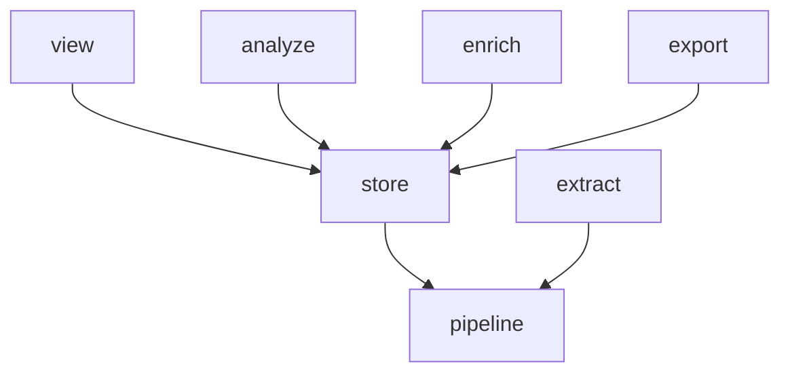

# Phase 3: the SQL library and the connection move into the store

Move the versioned SQL library out of `analyze/` and the viewer's fetch helpers out of `view/store.py` into `store/`, then replace the connection the viewer threads through 49 signatures with a `Store` handle. At the end, only `store` imports `duckdb`, the viewer no longer imports `analyze`, and the import graph has the shape it keeps.

Back to [the overview](overview.md). Stacks on [phase 2](phase-2-store-package.md).

## Problem

The SQL has two homes. Seventy statements live in `analyze/queries/` (41 of them `view_*.sql`), loaded and cited by `analyze/queries.py`; the macros both consumers install live in `analyze/macros.py`. The viewer reaches into `analyze` at 18 sites for them. The SQL that pages compose around those statements lives in `view/store.py`: `fetch`, `page_rows`, `window`, `cursorless_rows`, `bound`, `sorted_sessions`, and the `SORTS`, `FILTERS`, and `SHOWN` tables. Every viewer module that reads passes a `duckdb.DuckDBPyConnection`, making the driver the currency of a package that should not know it.

## Call paths, current → proposed

```
current:  page.read ─calls─ view.store.fetch(connection, Page.X, bindings) ─loads─ analyze.queries.statement ─over─ analyze.macros
          hp query ─calls─ analyze.runner.run ─loads─ analyze.queries.statement
          view.deps.request_store ─yields─ duckdb.DuckDBPyConnection

proposed: page.read ─calls─ store.library.fetch(store, Page.X, bindings) ─loads─ store.library.statement ─over─ store.macros
          hp query ─calls─ analyze.runner.run ─loads─ store.library.statement
          view.deps.request_store ─yields─ store.handle.Store
```

Phase 4 replaces `fetch(store, Page.X, …)` with `store.sessions.rollups(…)` page by page; phase 3 only moves the mechanism.

## File-tree diff

```
src/hyphae/
  store/
    queries/             ← analyze/queries/*.sql, all 70, unchanged
    library.py           ← analyze/queries.py: Query, Param, ParamType, Scope, load, statement, parameters, relations, citation, shown, the width constants
    macros.py            ← analyze/macros.py
    pages.py             ← view/store.py: Page, Fragment, Value, fetch, page_rows, window, cursorless_rows, bound, sorted_sessions, FILTERS, SHOWN, and SORTS minus its labels
    handle.py            + Store: holds the connection, opens with the wait a caller names, and is what a page or a pass receives
  analyze/
    queries/ queries.py macros.py   deleted
    manifest.py runner.py           ~ import from store.library
  view/
    store.py             deleted; `open_store` moves into store/handle.py
    deps.py              ~ request_store yields a Store
    pages/sessions/models.py   ~ owns the sort headings SORTS carried
    pages/**/*.py        ~ DuckDBPyConnection annotations become Store
tests/store/             ← tests/analyze/test_queries*.py, tests/analyze/test_macros*.py, tests/view/test_store*.py
tests/view/test_layout.py  ~ imports the library from store
tests/view/conftest.py     ~ builds a Store rather than a connection where it hands one to a page
pyproject.toml           ~ layers; the forbidden contract widens to every package but store
docs/store.md docs/viewer.md docs/analysis.md   ~ paths
CONTEXT.md               ~ Library points at store/queries/; new term Store handle
```



## Key contracts

```python
class Store:
    """One open trace store, for as long as the caller holds it.

    A page gets one per request (`PAGE_WAIT`); a pass or a query gets one per run
    (`CLI_WAIT`). Phase 4 hangs one repository per area off it.
    """
    def __init__(self, connection: duckdb.DuckDBPyConnection) -> None: ...

def open_store(path: Path, *, read_only: bool, wait: float) -> Generator[Store]: ...
```

`fetch` and its siblings take a `Store` and read `store.connection` inside `hyphae.store`; nothing outside the package touches the attribute. The linter enforces it:

```toml
[[tool.importlinter.contracts]]
name = "Only the store speaks DuckDB"
type = "forbidden"
source_modules = ["hyphae.cli", "hyphae.view", "hyphae.analyze", "hyphae.enrich", "hyphae.export", "hyphae.extract", "hyphae.pipeline", "hyphae.models"]
forbidden_modules = ["duckdb"]
```

The Query page's contract holds: `store.library.citation(name, bindings)` is the same function at a new path, and every footer still cites a statement `hp query` can run.

`SORTS` splits. The store keeps the column a sort key names and its direction; the heading a column prints under ("Started", "Session") moves to `view/pages/sessions/models.py`. That is the only place in this phase where code is rewritten rather than moved, keeping display vocabulary out of the store.

## Chosen test seam

No rendered bytes change. The oracle is the existing viewer tier: `tests/view/test_bounds__*.py` pin page bytes at every knob, and the gallery serves every scenario. `tests/store/test_library.py` drives `statement`, `parameters`, and `citation` as `tests/analyze/test_queries.py` did. `tests/store/test_handle.py` is new: it opens a fixture store at both waits and asserts that a second writer sees `StoreLocked`, as `docs/store.md:61` describes.

## Slices

1. **PR 3.1: the library and macros.** `git mv` the SQL directory and both modules; `analyze` and `view` import from `store.library` and `store.macros`. Verify: `rg 'analyze\.(queries|macros)' src tests tools` is empty; `mise run check`.
2. **PR 3.2: the fetch helpers.** `git mv src/hyphae/view/store.py src/hyphae/store/pages.py`; split `SORTS`; the viewer imports `store.pages`. Verify: `rg 'hyphae.analyze' src/hyphae/view` is empty, since the viewer now reaches statements through the store; `mise run check`.
3. **PR 3.3: the handle.** Add `Store` and `open_store`; `request_store` yields it; every `DuckDBPyConnection` annotation in `view/` and `analyze/runner.py` becomes `Store`; widen the forbidden contract. Verify: `rg 'duckdb' src/hyphae/view src/hyphae/analyze` is empty; `mise run lint-imports`; `mise run e2e` once, because this PR touches every page's read path.

## Decisions

- **All SQL moves, including the corpus statements `hp query` runs.** One home for SQL was the decision on 2026-09-16. `analyze` keeps what is not SQL: the manifest's production defaults, the runner's project relations, and the report templates. Alternative rejected: leave the corpus statements in `analyze` and move only `view_*`, which makes the library's location depend on who asked first.
- **`store/pages.py` keeps the viewer's enums for now.** Phase 4 deletes `Page`, `Fragment`, and `Value` one method at a time; carrying them through phase 3 keeps PR 3.2 a pure move.
- **A `Store` class rather than a `Protocol` over the connection.** The viewer needs a thing to hang repositories off; a protocol would only hide the driver's name.
- **The runner's `_PROJECT_SESSIONS` relation stays in `analyze/runner.py`.** Its comment gives the reason (`analyze/runner.py:22-26`): it is built from `--project`, which is the CLI's business. It is SQL outside the store, and the contract allows it because it composes a relation the library declares as its scope. Revisit in phase 5 if it reads as an exception.

## Out of scope

- Typed methods and result models belong in phase 4.
- Renaming `fetch`, `page_rows`, and the rest. Phase 4 deletes them rather than renaming them.
- The enrichment repository's selection SQL, already in `store/enrichment.py` since phase 2.3.

## Open questions

- `view/store.py:406 SHOWN` is a projection that cuts values at display widths. It reads as presentation, but the widths are the surface's, declared in `view/bounds.py`, and the cut is the `cut` macro the store owns. Recommendation: the store keeps `SHOWN` and takes the widths as bindings, as it does today; the viewer keeps deciding them.
- `tests/view/test_layout.py` pins the viewer's tree by AST and imports the library to do it. Check what it uses the library for before PR 3.1; it may only need the `view_` prefix constant.
